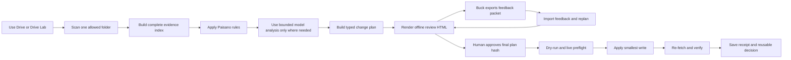

# Task Plan: Ship the Drive Vetting Workbench

## Goal Contract

### Objective

Build an installable, local-first, open-source Drive Vetting Workbench in this
directory. It must let Buck use Claude, GPT, a self-contained HTML review
surface, or a human-operated CLI to inventory one Google Drive folder,
understand the evidence, propose policy-backed renames and shortcut-based
organization, ask only material questions, require explicit approval, apply only
approved non-destructive changes, and verify every write. It must include a
small Drive-like filesystem simulator so the complete scan, plan, feedback,
approval, apply, and verify loop can be tested without credentials. The complete
flow must work against synthetic fixtures before any Buck credential or real
Drive item is used.

### Completion Criteria

- A clean checkout installs with one documented command and passes formatting,
  lint, type, unit, integration, end-to-end, and package checks.
- A scan enumerates every item visible through all API pages in the selected
  folder scope. It reports permission or export gaps instead of treating them as
  empty results.
- The local SQLite evidence index uses stable Drive item IDs, records parent and
  shortcut relationships, publishes complete scan generations atomically, and
  can be deleted and rebuilt from Drive.
- A versioned policy pack can express the Paisano taxonomy, naming rules,
  document types, entity aliases, protected items, archive rules, shortcut
  exceptions, and approved precedents.
- Every proposal has a typed action, stable target ID, reason code, source
  evidence, policy version, scan generation, expected preconditions, and
  confidence or review state.
- The only version 1 action types are `KEEP`, `RENAME`, `CREATE_SHORTCUT`,
  `PRESERVE_ARCHIVE`, and `NEEDS_REVIEW`. No delete or destructive move
  operation exists in the public contracts or provider interface.
- The system distinguishes live observed Drive state, declared Drive Context,
  approved human decisions, policy defaults, and model suggestions. A conflict
  blocks the affected action until a person resolves it.
- A question and decision loop stores Buck's answers with scope and provenance,
  reuses only relevant precedents, and does not ask the same resolved question
  again for the same scope.
- Model-assisted reasoning is provider-neutral, schema-validated, budgeted,
  cancellable, and unable to write to Drive. Invalid or incomplete model output
  fails closed.
- Read-only MCP tools let Claude or GPT inspect inventory, evidence, questions,
  proposals, and receipts. MCP exposes no mutation tool in version 1.
- A deterministic Drive Lab provides an interactive fake filesystem with
  folders, files, stable IDs, parents, shortcuts, permissions, pagination,
  content snippets, stale-state controls, failure injection, snapshot, and
  reset. It implements the same provider contracts as real Drive and cannot read
  outside its configured sandbox root.
- A generated review artifact is one self-contained HTML file. Buck can open it
  without a server, inspect the current and proposed filesystem, focus every
  visual node, review evidence, answer questions, accept, reject, or edit each
  proposal, and add global or action-level comments.
- The review artifact can export a versioned feedback packet by copy and
  download. Buck can paste the packet into Claude, GPT, the CLI, or a later
  generated review HTML. Import preserves every supported answer, edit, status,
  and comment without loss.
- Feedback packets are bound to a plan hash and review round. They are untrusted
  input. Unknown actions, stale plan hashes, invalid values, or injected markup
  are rejected. Feedback can request a new plan but cannot approve or execute
  one.
- The review HTML follows the understandability rules from the
  plans-and-presentations repository: editorial paper styling, category colors,
  taxonomy pills, claim captions, evidence disclosures, source ledger, glossary,
  accessible tabs, keyboard navigation, responsive layouts, print support, and
  reduced-motion behavior.
- Browser verification covers the HTML hero, each tab, the filesystem map in
  default and focused states, the feedback editor, desktop, mobile, print,
  keyboard use, and reduced motion. The artifact makes no network request.
- An approved plan contains an immutable plan hash. Apply performs a whole-plan
  preflight against live Drive state before the first write and blocks stale,
  colliding, protected, ambiguous, or unauthorized actions.
- Dry-run produces the exact ordered operation list and performs zero provider
  writes.
- Apply re-fetches each target, treats an already-satisfied action as a verified
  no-op, makes the smallest allowed write, re-fetches the result, and stores an
  append-only receipt with redacted before and after state.
- Interrupted or partial runs resume safely. A second apply of the same approved
  plan makes no duplicate shortcuts and no repeated renames.
- The repository contains no Buck file content, credentials, OAuth tokens,
  private entity data, or copied upstream source code. Synthetic fixtures cover
  the known failure cases.
- The open-source package includes a quick start, policy-pack guide, provider
  extension guide, threat model, pilot runbook, sample MCP configuration for
  Claude and GPT hosts, license, contribution guide, and release evidence.
- A fixture-backed pilot rehearsal produces a scorecard for coverage, proposal
  acceptance, question rate, blocked actions, write verification, idempotency,
  and estimated time saved. The real Buck pilot remains gated on his OAuth
  consent and one selected folder.

### Constraints

- There is no current access to Buck's Drive. Development, tests,
  demonstrations, and release checks must use synthetic data until the pilot
  gate.
- Use TypeScript with strict checks in a pnpm workspace. Support an active
  Node.js LTS version selected and recorded during T1.
- Keep the design local-first. Drive is the source of current item state. The
  SQLite index is a disposable evidence cache. The versioned policy pack stores
  operating rules. An approved plan is the only write authorization.
- Use stable Drive IDs as identity. Paths and names are mutable labels, not
  identity keys.
- Preserve originals. Reorganization uses shortcuts unless a future, separately
  approved contract adds move operations.
- Preserve archive folder structure when it carries deal, source, date, or
  sender identity.
- One source file normally has at most one organizational shortcut.
  `Bookkeeping Handoff` can create dated batch shortcuts without moving the
  originals.
- Treat file names, file bodies, comments, metadata, model output, and imported
  policy text as untrusted data. They cannot issue instructions to the runtime.
- Separate read credentials from write credentials where Google scopes allow it.
  Store tokens only in the user's local configuration directory with restrictive
  permissions.
- Require a human approval artifact before any real write. The model cannot
  approve its own plan.
- Prefer exact rules and compact evidence over broad model context. Do not
  require embeddings for version 1.
- Use concepts from codebase-memory-mcp and pi-rlm, but do not copy their
  source. Record license and attribution checks before release.
- Keep commands non-interactive in automated tests. Real OAuth and real writes
  require explicit operator action.
- Use ASD-STE100 style in operator-facing text. Use short sentences and one
  instruction per step.
- Generate the Buck review page as a portable HTML artifact with embedded local
  assets and embedded review data. It must not require a web server, remote
  font, remote script, analytics call, or account.
- Escape all Drive data, feedback, and policy text before HTML rendering. Use a
  restrictive content security policy and schema validation. Do not execute
  pasted content.
- Store Drive Lab state only inside its selected sandbox directory. Resolve and
  check every path. Refuse path traversal, symlink escape, and access to the
  real Drive provider when lab mode is active.
- Adapt the design system into this repository. Do not create a runtime
  dependency on `/Users/ronitdas/plans-and-presentations`.

### Non-Goals

- Delete files, empty trash, overwrite file bodies, or perform destructive bulk
  moves.
- Give an agent unrestricted Drive write tools.
- Build a hosted, multi-user, or production web service in version 1. The
  offline HTML review artifact is in scope.
- Run a background daemon or an unsupervised recurring organizer.
- Let the review HTML write to real Drive, approve its own plan, execute shell
  commands, or load remote code.
- Make a vector database, embeddings, Neo4j, an AST graph, an LSP server, or
  Cypher a required dependency.
- Require googleworkspace/cli, codebase-memory-mcp, or pi-rlm at runtime. Their
  useful patterns inform this design.
- Add a Notion Knowledge Base adapter, Box adapter, Dropbox adapter, or
  SharePoint adapter in version 1. The provider contracts must leave room for
  them.
- Migrate or modify Buck's real Drive during development.
- Promise a fixed labor saving before the pilot measures it.
- Replace Google Drive as the canonical file store.

## Planned System

### Operator path



### Four planes

| Plane     | Purpose                                                               | Main components                                                                                         | Trust rule                                                                      |
| --------- | --------------------------------------------------------------------- | ------------------------------------------------------------------------------------------------------- | ------------------------------------------------------------------------------- |
| Evidence  | Show what Drive contains and what the scan could not see.             | Drive provider, scanner, extractor boundary, SQLite generation index, query service                     | Scanning is read-only. Missing coverage is visible.                             |
| Decision  | Turn evidence and policy into reviewable proposals.                   | Policy engine, evidence builder, bounded reasoner, question memory, plan validator                      | Models suggest. Typed rules validate. Humans resolve material ambiguity.        |
| Review    | Make the evidence and choices easy for Buck to understand and return. | Single-file HTML generator, filesystem map, evidence drawers, feedback editor, packet import and export | The page is offline. Feedback can request a replan but cannot approve or write. |
| Execution | Apply only authorized changes and prove the result.                   | Approval artifact, preflight, deterministic executor, live verifier, append-only ledger, resume engine  | No approval means no write. No fresh verification means no success.             |

Drive Lab is a test environment below these planes. It implements the same read
and mutation contracts as Google Drive. A planner or executor must not need
special logic to use it.

### Source-of-truth order

1. Live Drive state supplies current names, parents, IDs, permissions, and write
   preconditions.
2. Approved human decisions resolve material questions within their recorded
   scope.
3. The versioned policy pack supplies default desired structure and naming
   rules.
4. Declared Drive Context supplies intent, but cannot silently override
   contradictory live evidence.
5. Model suggestions are advisory. They never override a rule, a decision, or a
   live precondition.

### Version 1 command surface

| Command               | Result                                                                        | Write ability                        |
| --------------------- | ----------------------------------------------------------------------------- | ------------------------------------ |
| `dvw scan`            | Create and publish a scan generation with coverage.                           | None                                 |
| `dvw inventory`       | Search or summarize observed items and relationships.                         | None                                 |
| `dvw plan`            | Build evidence-backed proposals and material questions.                       | Local plan files only                |
| `dvw questions`       | List unresolved decisions.                                                    | None                                 |
| `dvw decide`          | Save a human answer with scope and evidence.                                  | Local decision store only            |
| `dvw lab init`        | Create a deterministic Drive-like sandbox from a named scenario.              | Selected lab directory only          |
| `dvw lab tree`        | Inspect the current simulated filesystem and injected faults.                 | None                                 |
| `dvw lab edit`        | Make an explicit test-only change, such as a stale rename or permission loss. | Selected lab directory only          |
| `dvw lab snapshot`    | Save or compare a deterministic lab state snapshot.                           | Selected lab directory only          |
| `dvw lab reset`       | Restore the named lab scenario.                                               | Selected lab directory only          |
| `dvw review build`    | Generate the self-contained Buck review HTML from one plan.                   | Local artifact only                  |
| `dvw feedback import` | Validate and save a pasted or downloaded feedback packet.                     | Local decision and review state only |
| `dvw approve`         | Bind an approver to an immutable plan hash.                                   | Local approval artifact only         |
| `dvw dry-run`         | Revalidate and print the exact ordered operations.                            | None                                 |
| `dvw apply`           | Apply an approved plan after live preflight.                                  | Approved Drive mutations only        |
| `dvw verify`          | Re-fetch targets and inspect receipts.                                        | None                                 |
| `dvw report`          | Produce a run and pilot scorecard.                                            | None                                 |
| `dvw mcp`             | Start the read-only MCP server.                                               | None                                 |

### Core records

| Record                   | Required content                                                                                                                                       |
| ------------------------ | ------------------------------------------------------------------------------------------------------------------------------------------------------ |
| `ObservedItem`           | Stable ID, name, MIME type, parents, shortcut target, timestamps, permissions summary, content fingerprint when available, scan generation             |
| `ScanCoverage`           | Root scope, page tokens consumed, item count, exports attempted, denied items, unsupported types, warnings, generation state                           |
| `PolicyPack`             | Version, taxonomy, naming rules, document types, entities, protected items, archive rules, shortcut rules, precedents                                  |
| `EvidenceBundle`         | Target ID, observed facts, matched rules, candidate entities and document types, source locators, conflicts                                            |
| `DecisionRecord`         | Question key, answer, scope, approver, evidence, policy version, created time, supersession link                                                       |
| `ProposedAction`         | Action ID, type, target ID, desired state, reason code, evidence IDs, preconditions, confidence, review state                                          |
| `ApprovedPlan`           | Ordered actions, scan generation, policy version, plan hash, approver, approval time, expiry or invalidation reason                                    |
| `OperationReceipt`       | Run ID, action ID, attempt, before state, request summary, provider response summary, after state, verification result                                 |
| `RunLedger`              | Append-only events, state transitions, blocked reason, resume cursor, final metrics                                                                    |
| `SimulatedDriveManifest` | Lab ID, scenario version, stable nodes, parent edges, shortcuts, permissions, page boundaries, content locators, injected faults, deterministic clock  |
| `ReviewArtifactManifest` | Artifact version, plan hash, scan generation, policy version, data minimization record, generated time, included panels, source ledger                 |
| `ReviewFeedbackPacket`   | Packet version, artifact version, plan hash, review round, reviewer, question answers, action reviews, proposed edits, comments, export time, checksum |

### Buck review HTML contract

The review page is a generated dossier, not a generic dashboard. It contains
these tabs:

1. `Overview`: scope, scan coverage, policy version, proposal count, blockers,
   and the next required human action.
2. `Drive Map`: current folders, files, shortcuts, protected areas, and the
   proposed after-state. A focus control and clickable nodes open a detailed
   evidence panel.
3. `Proposed Changes`: one review row per action with before, after, reason,
   evidence, risk, and `Accept`, `Reject`, `Edit`, or `Ask` controls.
4. `Questions`: material decision packets with options, an evidence-backed
   default, a free answer, and scope selection.
5. `Feedback Packet`: validation status, copy, download, paste, import,
   round-trip preview, and a list of rejected fields if import fails.
6. `Receipts and Sources`: prior verified runs, claim captions, glossary, source
   locators, and the complete source ledger.

The page uses the plans-and-presentations explanation system:

- A masthead names the artifact version, plan hash, scan generation, policy
  version, and source snapshot.
- A serif hero states the one decision Buck must make next.
- A facts strip shows three or four measured facts. Every number links to its
  receipt.
- Color is a category system: blue for observed evidence, lime for policy, amber
  for human review, mint for safe or verified state, and rose for blockers or
  risk.
- Pills carry the taxonomy across tabs, tree nodes, action rows, status labels,
  and detail panels.
- Every focusable filesystem node has a detail panel with observed state,
  proposed state, matched rules, evidence, and impact.
- Every color-coded figure has a legend. Every claim has a figcaption or
  evidence disclosure.
- Jargon uses keyboard-accessible glossary buttons with source locators.
- Motion serves only the feedback return path and first-view reveals.
  Reduced-motion mode removes it.
- Mobile uses a readable ordered tree and stacked action reviews. Print expands
  all tabs, evidence, and decisions.
- The page uses warm paper colors, near-black ink, serif display type, humanist
  sans body type, and mono metadata. It uses no glowing gradients, glass
  effects, or repeated SaaS card grids.

### Feedback round-trip contract

Buck can work without a server:

1. Open the generated HTML.
2. Review actions and questions.
3. Add structured choices, proposed names, and free comments.
4. Copy or download the `ReviewFeedbackPacket`.
5. Paste the packet into Claude, GPT, `dvw feedback import`, or the import box
   in a later review HTML.
6. Validate the plan hash, review round, action IDs, schemas, and checksum.
7. Save accepted decisions and requested edits as review evidence.
8. Rebuild the plan and generate a new HTML round with a visible change summary.

The packet never counts as plan approval. After feedback changes a proposal, the
system creates a new plan hash. Buck must approve that final hash through the
CLI.

### Drive Lab simulator contract

Drive Lab uses a manifest plus synthetic content files inside one checked
sandbox root. It models the parts of Drive that affect this product:

- stable file and folder IDs;
- mutable names and parent relations;
- shortcuts and shortcut cycles;
- pagination and later-page items;
- readable, denied, unsupported, and protected items;
- text and Google-native export fixtures;
- content fingerprints and same-size different-content files;
- stale-state mutations between approval and apply;
- rate limits, partial failures, wrong after-state responses, and retry rules;
- deterministic clock, reset, snapshot, and diff.

`dvw scan`, `dvw plan`, `dvw review build`, `dvw dry-run`, `dvw apply`, and
`dvw verify` use the normal provider interfaces in lab mode. Tests must prove
that planner and executor code do not branch on the provider name.

### Run states

`Running`, `Completed`, `No-op`, `Blocked`, `Partial`, and `Failed` are the only
run states. `Completed` requires live after-state verification for every
effective action. `No-op` requires proof that every action was already
satisfied. `Partial` requires receipts for completed actions and a safe resume
point.

### Pilot gates

1. Fixture gate: all synthetic and adversarial tests pass.
2. Drive Lab gate: a person changes the fake filesystem, runs the planner,
   reviews the generated HTML, exports and reimports feedback, applies to the
   lab, and verifies the visible after-state.
3. Read-only gate: Buck grants access to one selected folder. The scan reports
   full visible coverage or explicit gaps.
4. Decision gate: Buck answers only the unresolved material questions through
   HTML or CLI. The system stores their scope.
5. Review gate: Buck reviews the regenerated HTML, checks the exact dry-run, and
   approves its final plan hash through the CLI.
6. Canary gate: the operator applies at most five low-risk actions and verifies
   each result in Drive.
7. Folder gate: the operator applies the remaining approved plan, verifies
   idempotency, and records the scorecard.
8. Expansion gate: another folder enters scope only after the first scorecard
   meets the safety thresholds.

### Pilot success measures

| Measure                                       |        Required safety threshold |                                 Learning target |
| --------------------------------------------- | -------------------------------: | ----------------------------------------------: |
| Visible scan coverage                         |          100%, or each gap named |                                            100% |
| Unapproved writes                             |                                0 |                                               0 |
| Successful writes with live verification      |                             100% |                                            100% |
| Repeated writes on second apply               |                                0 |                                               0 |
| Ambiguous actions executed                    |                                0 |                                               0 |
| Feedback fields lost on export and import     |                                0 |                                               0 |
| Review HTML network requests                  |                                0 |                                               0 |
| Items classified without a Buck question      |        No fixed safety threshold | At least 70% after the first calibration folder |
| Proposals accepted without edit               |        No fixed safety threshold |                   At least 80% before expansion |
| Direct Buck effort reduction                  |  Measure against a manual sample |                    50% to 70% after calibration |
| Mechanical rename and shortcut work automated | Measure against approved actions |                                      80% to 95% |

The learning targets are hypotheses from the current discovery work. They are
not completion claims. The pilot must replace them with measured results.

## Baseline

- **Command:**
  `cd /Users/ronitdas/plans-and-presentations && git status --short`
- **Result:** Exit 0. The repository was clean before this plan was added.
- **Command:** `cd /Users/ronitdas/plans-and-presentations && npm test`
- **Result:** Exit 1. The host presentation repository passed 57 of 58 tests.
- **Existing failures:** `scripts/ontology-field-guide.test.js` fails
  `stacks the masthead in a narrow preview pane` because the expected
  `.masthead` responsive rule is absent from the inspected HTML. This is outside
  the Drive Vetting Workbench scope. The implementation must not add new
  host-repository failures.
- **Command:** `node --version`, `pnpm --version`, and `npm --version`
- **Result:** Exit 0. Node is `v24.8.0`, pnpm is `9.15.4`, and npm is `11.6.0`.
- **Command:**
  `cd /Users/ronitdas/drive-vetting-workbench && git rev-parse --show-toplevel && git status --short`
- **Result:** Exit 0 after the requested move. The repository root is
  `/Users/ronitdas/drive-vetting-workbench` on branch `main`. `.gitignore`,
  `END-REPORT.md`, and `TASK-PLAN.md` are untracked. No implementation files or
  commits exist.
- **Command:**
  `ls -la /Users/ronitdas/plans-and-presentations/drive-vetting-workbench`
- **Result:** Exit 1 after the move. The incorrect nested location no longer
  exists.
- **Environment notes:** macOS, zsh, Git `2.39.3`. There are no Buck Drive
  credentials or Buck Drive fixtures in scope. The plans-and-presentations
  repository is a read-only design reference for this plan. All product build
  and test commands must run from `/Users/ronitdas/drive-vetting-workbench`. The
  product must use synthetic fixtures and Drive Lab until the explicit read-only
  pilot gate.

## Runner Handoffs

### Codex Goal Handoff

```text
/goal Implement the outcome defined in /Users/ronitdas/drive-vetting-workbench/TASK-PLAN.md.

Use its Goal Contract as the stable completion contract and its Execution Plan as the adaptive canonical ledger. Reconcile the document with the workspace before acting and after every worker report. The coordinator alone edits the task document. Workers return structured evidence and must not edit it. Execute dependency-ready tasks. Use parallel workers only for Batch B, where the plan records disjoint write ownership, and reconcile them in T6. Run the prescribed baseline-aware verification before marking work complete. Do not use Buck credentials or data before the pilot gate. Never add a delete or destructive move path. Treat Drive Lab, the offline Buck review HTML, and lossless feedback round-trip as required product behavior.

At every task or batch boundary, material replan, and before ending a turn, emit CHECKPOINT with completed task IDs, commands and evidence, current risks or blockers, ledger changes, and the next dependency-ready task. On resume, re-read the Goal Contract, inspect actual workspace state, verify prior claims, record divergence, and continue. Finish only when every Completion Criterion is supported by fresh evidence. Do not finish because the original checklist is exhausted.
```

### Claude Code Goal Handoff

```text
/goal Implement the outcome defined in /Users/ronitdas/drive-vetting-workbench/TASK-PLAN.md.

Use its Goal Contract as the stable completion contract and its Execution Plan as the adaptive canonical ledger. Reconcile it with actual workspace state before acting. The coordinator alone edits the task document. Workers must not edit it and instead return task ID, result, files changed, commands, evidence, risks, and follow-ups. Native Task state may mirror the ledger but is never authoritative. Use concurrency only for Batch B, where write ownership is disjoint, and integrate all results in T6. Do not use Buck credentials or data before the pilot gate. Never add a delete or destructive move path. Treat Drive Lab, the offline Buck review HTML, and lossless feedback round-trip as required product behavior.

End EVERY Goal turn with a transcript-visible block:
GOAL EVIDENCE
- Goal status: active | complete | blocked
- Completed or changed task IDs:
- Commands run and observed results:
- Ledger or decision changes:
- Risks or blocker evidence:
- Next dependency-ready task:

On resume, re-read the task document, inspect workspace and native-task state, verify prior completion claims, log divergence, and continue. Declare completion only when fresh evidence supports every Completion Criterion, not when listed tasks are exhausted.
```

## Execution Strategy

### Parallelism Decision

Use a mixed strategy. T1 and T2 are sequential because they establish the
toolchain and shared contracts. After T2, policy work, provider work, and SQLite
work have disjoint write ownership, so T3, T4, and T5 form one safe parallel
batch. T6 depends on all three and owns the first cross-package integration. The
later tasks are sequential because the planner, Drive Lab, review artifact,
feedback import, approval, and execution path share versioned contracts and
safety state. This avoids a UI packet that disagrees with the planner or a
simulator that behaves differently from the real provider. The coordinator must
inspect each worker report and run T6 verification before work continues.

### Runtime State

- **Canonical ledger:** this document
- **Coordinator:** primary Codex or Claude Code Goal session
- **Active batch:** Complete — no dependency-ready tasks remain
- **Mirrored native tasks:** Goal reconciliation is complete; native milestones
  mirror this ledger but are not authoritative

The coordinator owns this document. Workers must not edit it. Workers report
evidence to the coordinator for reconciliation.

Each worker report must use this format:

```text
TASK REPORT
Task ID:
Result: complete | partial | blocked
Files changed:
Commands and observed results:
Acceptance evidence:
Risks or unresolved questions:
Suggested follow-ups:
```

## Execution Plan

| ID  | Task                                                                            | Status   | Depends On                   | Batch           | Files                                                                                                                                                                                                                                                                                                                                                                                                                                                                                                                                                                                                                                         | Capability                                                                     | Verification                                    | Evidence                                                                                                                                                                                                                                                                                                                                                                                                                                                                                                                                                                                                                                                                                                                                                                                                                                                                                                                                                                                                                                                                                                                                                                                                                                                                                                                                                                                                                                                                                                                                                                                                                                                                                                                                                                                                                                                                                  |
| --- | ------------------------------------------------------------------------------- | -------- | ---------------------------- | --------------- | --------------------------------------------------------------------------------------------------------------------------------------------------------------------------------------------------------------------------------------------------------------------------------------------------------------------------------------------------------------------------------------------------------------------------------------------------------------------------------------------------------------------------------------------------------------------------------------------------------------------------------------------- | ------------------------------------------------------------------------------ | ----------------------------------------------- | ----------------------------------------------------------------------------------------------------------------------------------------------------------------------------------------------------------------------------------------------------------------------------------------------------------------------------------------------------------------------------------------------------------------------------------------------------------------------------------------------------------------------------------------------------------------------------------------------------------------------------------------------------------------------------------------------------------------------------------------------------------------------------------------------------------------------------------------------------------------------------------------------------------------------------------------------------------------------------------------------------------------------------------------------------------------------------------------------------------------------------------------------------------------------------------------------------------------------------------------------------------------------------------------------------------------------------------------------------------------------------------------------------------------------------------------------------------------------------------------------------------------------------------------------------------------------------------------------------------------------------------------------------------------------------------------------------------------------------------------------------------------------------------------------------------------------------------------------------------------------------------------- |
| T1  | Scaffold the standalone workspace and quality gates                             | Complete | -                            | A1 (Sequential) | `package.json`, `pnpm-lock.yaml`, `pnpm-workspace.yaml`, `tsconfig.base.json`, `eslint.config.js`, `.prettierrc.json`, `.gitignore`, `.github/workflows/ci.yml`, `scripts/**`                                                                                                                                                                                                                                                                                                                                                                                                                                                                 | TypeScript workspace and CI setup                                              | `pnpm verify:scaffold`                          | Fresh `pnpm verify` exit 0: 17 unit/config, 1 integration, 2 e2e, and 1 security test; build, SQLite, boundary, package dry-run, and diff checks pass. Parent remains the known 57/58.                                                                                                                                                                                                                                                                                                                                                                                                                                                                                                                                                                                                                                                                                                                                                                                                                                                                                                                                                                                                                                                                                                                                                                                                                                                                                                                                                                                                                                                                                                                                                                                                                                                                                                    |
| T2  | Define stable domain contracts and state machines                               | Complete | T1                           | A2 (Sequential) | `packages/core/**`                                                                                                                                                                                                                                                                                                                                                                                                                                                                                                                                                                                                                            | Domain modeling and schema design                                              | `pnpm --filter @dvw/core test`                  | Fresh core test exit 0: 25/25 tests, typecheck and lint pass; schema snapshot and destructive-surface review pass.                                                                                                                                                                                                                                                                                                                                                                                                                                                                                                                                                                                                                                                                                                                                                                                                                                                                                                                                                                                                                                                                                                                                                                                                                                                                                                                                                                                                                                                                                                                                                                                                                                                                                                                                                                        |
| T3  | Implement the policy engine and Paisano policy pack                             | Complete | T2                           | B (Parallel)    | `packages/policy-engine/**`, `packs/paisano/**`                                                                                                                                                                                                                                                                                                                                                                                                                                                                                                                                                                                               | Rules engine and domain policy modeling                                        | `pnpm --filter @dvw/policy-engine test`         | Fresh coordinator run: 10/10 tests, typecheck, and build pass; seven golden snapshots cover all acceptance fixtures.                                                                                                                                                                                                                                                                                                                                                                                                                                                                                                                                                                                                                                                                                                                                                                                                                                                                                                                                                                                                                                                                                                                                                                                                                                                                                                                                                                                                                                                                                                                                                                                                                                                                                                                                                                      |
| T4  | Implement provider contracts and the instrumented fake Drive                    | Complete | T2                           | B (Parallel)    | `packages/drive-provider/**`, `fixtures/drive-provider/**`                                                                                                                                                                                                                                                                                                                                                                                                                                                                                                                                                                                    | Google Drive API abstraction and test doubles                                  | `pnpm --filter @dvw/drive-provider test`        | Fresh coordinator run: 12/12 tests, typecheck, and build pass; synthetic contract fixture and mutation-surface review pass.                                                                                                                                                                                                                                                                                                                                                                                                                                                                                                                                                                                                                                                                                                                                                                                                                                                                                                                                                                                                                                                                                                                                                                                                                                                                                                                                                                                                                                                                                                                                                                                                                                                                                                                                                               |
| T5  | Implement the SQLite evidence index with atomic generations                     | Complete | T2                           | B (Parallel)    | `packages/evidence-store-sqlite/**`                                                                                                                                                                                                                                                                                                                                                                                                                                                                                                                                                                                                           | SQLite schema, migrations, indexing, and transactions                          | `pnpm --filter @dvw/evidence-store-sqlite test` | Fresh coordinator run: 10/10 tests, typecheck, build, migration artifact, relation schema, and destructive-surface checks pass.                                                                                                                                                                                                                                                                                                                                                                                                                                                                                                                                                                                                                                                                                                                                                                                                                                                                                                                                                                                                                                                                                                                                                                                                                                                                                                                                                                                                                                                                                                                                                                                                                                                                                                                                                           |
| T6  | Integrate the complete read-only scan pipeline                                  | Complete | T3, T4, T5                   | C (Integration) | `packages/scanner/**`, `packages/content-extractor/**`, `tests/integration/scan/**`                                                                                                                                                                                                                                                                                                                                                                                                                                                                                                                                                           | Integration engineering and coverage analysis                                  | `pnpm test:scan-integration`                    | Fresh `pnpm verify` exit 0: 77 unit, 4 integration, 2 e2e, and 1 security test. The 8-item/4-page scan publishes atomically, finds the final-page item, records typed gaps and a cycle, preserves the prior active generation after failure, and records zero writes.                                                                                                                                                                                                                                                                                                                                                                                                                                                                                                                                                                                                                                                                                                                                                                                                                                                                                                                                                                                                                                                                                                                                                                                                                                                                                                                                                                                                                                                                                                                                                                                                                     |
| T7  | Expose compact read-only queries and MCP tools                                  | Complete | T6                           | D1 (Sequential) | `packages/query-service/**`, `apps/mcp-server/**`, `tests/integration/mcp/**`                                                                                                                                                                                                                                                                                                                                                                                                                                                                                                                                                                 | MCP server design and read-only API security                                   | `pnpm test:mcp`                                 | Fresh MCP integration passes 2/2 with tool-contract and read-transcript snapshots. A real MCP client enumerates exactly eight bounded read-only tools, finds prompt-like evidence as data, follows parent/shortcut relations, paginates with generation-bound cursors, and cannot call an unregistered mutation tool.                                                                                                                                                                                                                                                                                                                                                                                                                                                                                                                                                                                                                                                                                                                                                                                                                                                                                                                                                                                                                                                                                                                                                                                                                                                                                                                                                                                                                                                                                                                                                                     |
| T8  | Build deterministic evidence bundles and classification candidates              | Complete | T6                           | D2 (Sequential) | `packages/evidence-builder/**`, `tests/integration/evidence/**`                                                                                                                                                                                                                                                                                                                                                                                                                                                                                                                                                                               | Evidence engineering and deterministic classification                          | `pnpm --filter @dvw/evidence-builder test`      | Fresh package tests pass 10/10 and the SQLite-to-evidence integration passes 1/1. Five golden packets cover simple, exact-duplicate, cross-deal, protected, and archive cases. Full `pnpm verify` passes 87 unit, 7 integration, 2 end-to-end, and 1 security test plus every build, format, lint, type, SQLite, boundary, artifact, and package gate.                                                                                                                                                                                                                                                                                                                                                                                                                                                                                                                                                                                                                                                                                                                                                                                                                                                                                                                                                                                                                                                                                                                                                                                                                                                                                                                                                                                                                                                                                                                                    |
| T9  | Add provider-neutral bounded reasoning with run-tree evidence                   | Complete | T8                           | D3 (Sequential) | `packages/reasoning/**`, `tests/integration/reasoning/**`                                                                                                                                                                                                                                                                                                                                                                                                                                                                                                                                                                                     | LLM orchestration, schema validation, budgets, and cancellation                | `pnpm test:reasoning`                           | Fresh reasoning verification passes 19/19 package tests and 1/1 evidence-to-reasoning integration. Stable transcript and run-tree snapshots cover fixed capabilities, schema validation, retries, depth, branches, context, output, token, step, elapsed, cancellation, injection, and provider failures. Full `pnpm verify` passes 106 unit, 8 integration, 2 end-to-end, and 1 security test plus all package gates.                                                                                                                                                                                                                                                                                                                                                                                                                                                                                                                                                                                                                                                                                                                                                                                                                                                                                                                                                                                                                                                                                                                                                                                                                                                                                                                                                                                                                                                                    |
| T10 | Add the question, decision, and precedent memory loop                           | Complete | T3, T5, T9                   | D4 (Sequential) | `packages/decision-memory/**`, `packages/evidence-store-sqlite/src/migrations/002_decisions.sql`, the migration-list expectation in `packages/evidence-store-sqlite/src/evidence-store.test.ts`, `tests/integration/decisions/**`                                                                                                                                                                                                                                                                                                                                                                                                             | Decision modeling and scoped retrieval                                         | `pnpm test:decisions`                           | Fresh decision verification passes 11/11 package cases and 1/1 integration. Deterministic keys cover all five scopes; compatible decisions resolve matching later evidence, while unrelated scopes, policy changes, live conflicts, and invalid choices require review. SQLite tests prove immutable history, explicit supersession, one active decision, and defensive pointer integrity. Full `pnpm verify` exits 0 with 117 unit, 9 integration, 2 end-to-end, and 1 security test.                                                                                                                                                                                                                                                                                                                                                                                                                                                                                                                                                                                                                                                                                                                                                                                                                                                                                                                                                                                                                                                                                                                                                                                                                                                                                                                                                                                                    |
| T11 | Build typed change plans and whole-plan validation                              | Complete | T8, T9, T10                  | D5 (Sequential) | `packages/change-planner/**`, `tests/integration/planning/**`                                                                                                                                                                                                                                                                                                                                                                                                                                                                                                                                                                                 | Planning algorithms and safety validation                                      | `pnpm test:planning`                            | Fresh planner verification passes 26/26 package cases and 1/1 evidence-to-reasoning-to-decision-to-plan integration. Plans are immutable and deterministic, bind live source and shortcut-destination preconditions plus human decision IDs, document their canonical hash fields, and expose only planning APIs. Every recorded whole-plan blocker and destructive-shaped input fails closed. Full `pnpm verify` exits 0 with 143 unit, 10 integration, 2 end-to-end, and 1 security test.                                                                                                                                                                                                                                                                                                                                                                                                                                                                                                                                                                                                                                                                                                                                                                                                                                                                                                                                                                                                                                                                                                                                                                                                                                                                                                                                                                                               |
| T12 | Implement the read and planning CLI workflow                                    | Complete | T7, T11                      | D6 (Sequential) | `apps/cli/src/commands/scan.ts`, `apps/cli/src/commands/inventory.ts`, `apps/cli/src/commands/plan.ts`, `apps/cli/src/commands/questions.ts`, `apps/cli/src/commands/decide.ts`, `apps/cli/src/io/**`, `tests/integration/cli-read/**`                                                                                                                                                                                                                                                                                                                                                                                                        | CLI design and accessible operator output                                      | `pnpm test:cli-read`                            | Fresh CLI integration passes 3/3. The synthetic workflow scans two paginated items, inventories safe metadata, builds a blocked plan, lists and saves one scoped answer, and rebuilds an eligible rename plan in human and strict JSON modes. All five exit codes, explicit root scope, append-only artifacts, context binding, terminal sanitization, ID redaction, body omission, and zero provider mutations are verified. Full `pnpm verify` exits 0 with 143 unit, 13 integration, 2 end-to-end, and 1 security test.                                                                                                                                                                                                                                                                                                                                                                                                                                                                                                                                                                                                                                                                                                                                                                                                                                                                                                                                                                                                                                                                                                                                                                                                                                                                                                                                                                |
| T13 | Build the interactive Drive Lab simulator                                       | Complete | T4, T5, T12                  | D7 (Sequential) | `packages/drive-simulator/**`, `apps/cli/src/commands/lab.ts`, `fixtures/lab/**`, `tests/integration/lab/**`                                                                                                                                                                                                                                                                                                                                                                                                                                                                                                                                  | Filesystem simulation, sandbox security, and interaction design                | `pnpm test:lab`                                 | Fresh Drive Lab verification passes 17/17 package cases and 2/2 integration cases. Seven cataloged scenarios prove pagination, permission gaps, shortcut cycles, protected archives, stale preconditions, partial failure, and stable content-addressed snapshots. The CLI initializes, trees, explicitly edits, snapshots, diffs, and append-only resets one sandbox; the unchanged scan/planner selector sees edits; shared rename and shortcut writes are re-fetched into a verified synthetic receipt. Traversal, absolute, null-byte, symlink, corrupt-state, parent-cycle, stale-token, invalid-edit, and destructive-surface cases fail closed. `pnpm lab:demo` exits 0. Fresh `pnpm verify` exits 0 with 160 unit, 15 integration, 2 end-to-end, and 1 security test.                                                                                                                                                                                                                                                                                                                                                                                                                                                                                                                                                                                                                                                                                                                                                                                                                                                                                                                                                                                                                                                                                                             |
| T14 | Generate the self-contained Buck review HTML                                    | Complete | T7, T11, T13                 | D8 (Sequential) | `packages/review-artifact/**`, `apps/review-preview/**`, `tests/browser/review/**`, `docs/design-system.md`                                                                                                                                                                                                                                                                                                                                                                                                                                                                                                                                   | Frontend design, accessibility, static artifact generation, and browser QA     | `pnpm test:review-ui`                           | Fresh review verification passes 5/5 renderer cases and 1/1 real Drive Lab fixture case. The create-only artifact binds plan, review round, and HTML bytes, embeds hashed CSS/controller plus inert escaped data under a restrictive CSP, renders all six accessible panels and five focusable map nodes, and exposes only local review state. `pnpm review:build:fixture` emits plan `a852…daae`, artifact `ecd62…61a8`, and the exact checked-in `messy-paisano` snapshot. `pnpm review:browser-check` passes 5/5 from `file://`; axe reports 0 violations across six tabs, instrumentation reports 0 network requests, and 19 desktop, mobile, map, feedback, print, reduced-motion, and injection captures plus a print PDF are fresh. Full `pnpm verify` exits 0 with 165 unit, 15 integration, 2 end-to-end, and 1 security test. Parent remains the known 57/58.                                                                                                                                                                                                                                                                                                                                                                                                                                                                                                                                                                                                                                                                                                                                                                                                                                                                                                                                                                                                                   |
| T15 | Implement lossless feedback export, paste, import, and replan                   | Complete | T10, T11, T12, T14           | D9 (Sequential) | `packages/feedback/**`, `apps/cli/src/commands/review.ts`, `apps/cli/src/commands/feedback.ts`, `tests/integration/feedback/**`, `tests/browser/feedback/**`                                                                                                                                                                                                                                                                                                                                                                                                                                                                                  | Feedback schema design, clipboard workflow, validation, and round-trip testing | `pnpm test:feedback`                            | Fresh T15 verification passes 11/11 packet cases, 5/5 integration cases, and 3/3 offline browser cases. The canonical packet `58a06d…3b99` round-trips byte-for-byte through clipboard fallback, download, file, raw/fenced paste, real CLI import, regenerated HTML, and local draft restore/clear. Strict context, checksum, IDs, duplicate, scope, choice, type, name, markup, executable text, and stale-plan failures are field-precise. Edit/Ask create a new blocked review round; Accept is never approval; Reject only removes a proposal. `pnpm verify` exits 0 with 177 unit, 20 integration, 2 end-to-end, and 1 security test; parent remains the known 57/58.                                                                                                                                                                                                                                                                                                                                                                                                                                                                                                                                                                                                                                                                                                                                                                                                                                                                                                                                                                                                                                                                                                                                                                                                               |
| T16 | Add immutable approval artifacts and zero-write dry-run                         | Complete | T11, T12, T15                | E1 (Sequential) | `packages/execution/src/approval.ts`, `packages/execution/src/preflight.ts`, `packages/execution/src/dry-run.ts`, `apps/cli/src/commands/approve.ts`, `apps/cli/src/commands/dry-run.ts`, `tests/integration/preflight/**`                                                                                                                                                                                                                                                                                                                                                                                                                    | Authorization design and fail-closed validation                                | `pnpm test:preflight`                           | Fresh corrective verification passes 4/4 approval and 11/11 preflight/CLI cases. A RED regression proved that self-consistent hand-authored plans could hide `NEEDS_REVIEW` or blocked actions; canonical approval now rejects both as `PLAN_NOT_ELIGIBLE`. All hash, checksum, expiry, protected, stale, permission, missing, pagination, direct-parent collision, no-op, and zero-write guarantees remain green. Fresh `pnpm verify` exits 0 with 181 unit, 40 integration, 2 end-to-end, and 1 security test; the parent baseline remains exactly 57/58.                                                                                                                                                                                                                                                                                                                                                                                                                                                                                                                                                                                                                                                                                                                                                                                                                                                                                                                                                                                                                                                                                                                                                                                                                                                                                                                               |
| T17 | Implement the deterministic non-destructive executor                            | Complete | T4, T13, T16                 | E2 (Sequential) | `packages/execution/src/{executor,operations,errors}.ts`, `apps/cli/src/commands/apply.ts`, `tests/integration/execution/**`, and narrow existing CLI router/argument/contract/output/root-script surfaces required to register operator apply and select a distinct execution provider                                                                                                                                                                                                                                                                                                                                                       | Transactional workflow and API mutation control                                | `pnpm test:execution`                           | Fresh `pnpm test:execution` passes 4/4 approval and 9/9 execution integration cases. Exact operator confirmation and local approval validation occur before distinct execution-provider selection. Whole-plan preflight precedes every write; each target is re-fetched; fake and Drive Lab share one path; stable IDs, exact shortcut no-op, read failure, provider failure, unexpected-success response, and fail-stop partial behavior are covered. `KEEP` and `PRESERVE_ARCHIVE` are zero-write; `NEEDS_REVIEW` is rejected before provider selection. The ordered call log contains only `rename` then `createShortcut`; a static executable scan found no delete, trash, move, overwrite, or body-write call. Fresh `pnpm verify` exits 0 with 181 unit, 40 integration, 2 end-to-end, and 1 security test; parent remains exactly 57/58.                                                                                                                                                                                                                                                                                                                                                                                                                                                                                                                                                                                                                                                                                                                                                                                                                                                                                                                                                                                                                                           |
| T18 | Add live verification, receipts, resume, and idempotency                        | Complete | T5, T17                      | E3 (Sequential) | `packages/execution/src/{verifier,ledger,resume,executor}.ts`, `packages/evidence-store-sqlite/src/migrations/003_execution.sql`, its migration-list expectation, `apps/cli/src/commands/{apply,verify}.ts`, and narrow existing CLI router/argument/contract/output/root-script surfaces needed to register verified apply and read-only verify                                                                                                                                                                                                                                                                                              | Durable execution state and recovery                                           | `pnpm test:resume`                              | Fresh `pnpm test:resume` passes 4/4 execution unit and 4/4 resume integration cases. Accepted writes and no-ops are re-fetched and recorded before the next action; wrong after-state fails closed; partial attempts retain redacted immutable receipts and a safe cursor; resume verifies prior actions without repeating writes; independent verify is read-only; fake and Drive Lab second applies make zero mutations. Terminal runs reject event and receipt appends, and SQLite triggers reject direct updates. The executable mutation scan finds only `rename` and `createShortcut`. Fresh `pnpm verify` exits 0 with 181 unit, 44 integration, 2 end-to-end, and 1 security test; parent remains exactly 57/58.                                                                                                                                                                                                                                                                                                                                                                                                                                                                                                                                                                                                                                                                                                                                                                                                                                                                                                                                                                                                                                                                                                                                                                  |
| T19 | Implement staged-scope OAuth and the real Google Drive provider                 | Complete | T6, T18                      | F1 (Sequential) | `packages/drive-google/**`, `tests/contract/google-drive/**`, `docs/adr/001-google-drive-provider.md`, and the narrow root `package.json`/`pnpm-lock.yaml` changes required to register the offline and opt-in sandbox tests and the official clients                                                                                                                                                                                                                                                                                                                                                                                         | Google Drive v3 integration, OAuth, Shared Drives, and contract testing        | `pnpm test:google-contract`                     | Fresh offline contract passes 13/13. It proves fake/Google mapping parity, loopback PKCE and CSRF validation, separate exact-scope tokens, read-only capability isolation, Shared Drive flags and pagination, typed bounded read retries, no mutation retry, redacted requests/errors, runtime mode rejection, `0700`/`0600` storage, and canonical-path symlink rejection. The static provider scan finds only name-only `files.update` and shortcut-only `files.create`; no forbidden mutation call exists. Fresh `pnpm verify` passes 181 unit, 57 integration, 2 end-to-end, and 1 security test plus format, lint, type, build, boundary, artifact, and package gates; the optional sandbox is the sole skipped test and remains unrun. The parent baseline is exactly 57/58 with the same sole narrow-masthead failure.                                                                                                                                                                                                                                                                                                                                                                                                                                                                                                                                                                                                                                                                                                                                                                                                                                                                                                                                                                                                                                                             |
| T20 | Harden secrets, HTML, feedback, prompt boundaries, logs, and mutation isolation | Complete | T7, T9, T14, T15, T16, T19   | F2 (Sequential) | `packages/security/**`, `tests/security/**`, `docs/threat-model.md`, `SECURITY.md`, the policy-integrity changes in `packages/policy-engine/src/loader.ts`, `packages/policy-engine/src/policy-engine.test.ts`, and `packs/paisano/pack.json`; redaction-boundary changes in `packages/content-extractor/src/index.ts`, `packages/scanner/src/index.ts`, `packages/execution/src/{errors,preflight}.ts`, their package manifests and TypeScript configs, `tsconfig.json`, and `vitest.workspace-aliases.ts`; and the narrow root `package.json`/`pnpm-lock.yaml` changes required to register the security package and prescribed secret scan | Security threat analysis and negative testing                                  | `pnpm test:security`                            | Fresh hostile verification passes 19/19 across eight security files. The machine-checked threat model maps all 16 named threats and every control to real tests or prescribed commands. Policy integrity passes 11/11 with exact SHA-256 section binding. Provider text is redacted before execution errors, extraction gaps, and scan evidence persist. Hostile file text, model output, HTML, CSP, feedback, approval, Drive Lab paths, OAuth modes/scopes, tokens, and MCP tool confusion fail closed. `pnpm scan:secrets` reports no findings; `pnpm audit --audit-level high` reports no known vulnerabilities; the executable mutation scan finds no forbidden method and inventories only Google `files.update`/`files.create` plus executor `rename`/`createShortcut`. Fresh `pnpm verify` passes 182 unit, 57 integration, 2 end-to-end, and 19 security tests; the optional Google sandbox is the sole skip. The parent baseline remains exactly 57/58 with the same narrow-masthead failure. No Buck data, credential, or live provider was used.                                                                                                                                                                                                                                                                                                                                                                                                                                                                                                                                                                                                                                                                                                                                                                                                                              |
| T21 | Run the full adversarial synthetic end-to-end suite                             | Complete | T10, T11, T13, T15, T18, T20 | G1 (Sequential) | `fixtures/adversarial/**`, `tests/e2e/**`, `scripts/reset-fixtures.ts`, and the narrow root `package.json`/`pnpm-lock.yaml` registration required for append-only fixture reset, no-real-data verification, full Vitest-plus-Playwright E2E composition, and the workspace-only simulator development link                                                                                                                                                                                                                                                                                                                                    | End-to-end testing and failure analysis                                        | `pnpm test:e2e`                                 | A machine-checked 28-case synthetic matrix covers the required scan, policy, model, stale-state, partial-failure, resume, idempotency, offline review, feedback, responsive, keyboard, print, reduced-motion, and hostile-input scenarios. Fresh `pnpm test:e2e` passes 14/14 Vitest E2E, 5/5 review-browser, and 3/3 feedback-browser checks. The human loop changes Drive Lab, scans all pages, plans, builds offline HTML, exports/imports lossless feedback, replans, regenerates HTML, approves separately, dry-runs with zero writes, applies the verified rename, compares the tree, verifies the run, and proves second-apply idempotency. `pnpm fixtures:reset` restores all seven scenarios through append-only reset with stable hashes. `pnpm verify:no-real-data` combines a no-findings secret scan with source, fixture, provider, credential, and network isolation assertions. A fresh full `pnpm verify` exits 0 with 182 unit, 57 runnable integration, 14 Vitest E2E, 8 browser, and 19 security tests; the optional Google sandbox is the sole skip. The fresh parent baseline remains exactly 57/58 with the same sole narrow-masthead failure. No Buck data, credential, real provider, delete path, or destructive move was used or added.                                                                                                                                                                                                                                                                                                                                                                                                                                                                                                                                                                                                                        |
| T22 | Package the open-source project and extension guides                            | Complete | T14, T21                     | G2 (Sequential) | `README.md`, `LICENSE`, `NOTICE`, `CONTRIBUTING.md`, `docs/quickstart.md`, `docs/policy-packs.md`, `docs/provider-guide.md`, `docs/mcp-hosts.md`, `docs/architecture.md`, `docs/review-workflow.md`, `docs/drive-lab.md`, `docs/dependency-licenses.md`, `examples/**`, `scripts/check-docs.mjs`, `scripts/check-licenses.mjs`, `scripts/check-package-manifest.mjs`, `scripts/verify-cleanroom-quickstart.mjs`, the focused release-check test under `scripts/**`, the narrow idempotent migration-copy correction in `packages/evidence-store-sqlite/package.json`, and `package.json`                                                      | Technical writing, release packaging, and license review                       | `pnpm verify:package`                           | Apache-2.0 `LICENSE`, `NOTICE`, contribution and security policies, quick start, Drive Lab, review, policy, provider, MCP host, architecture, design, threat, and dependency-license guidance are packaged and link checked. Five focused release tests cover links, documented commands, license policy, manifest exclusions, and idempotent built migrations. A retained clean-room copy installs from the frozen lock offline, builds from source, scans four items over two pages, produces the self-contained review and lossless feedback packet, proves feedback grants no approval, dry-runs with zero writes, applies one separately approved verified rename, makes zero network calls, and replays with zero mutations. The dependency gate reviews 237 entries across nine accepted license classes; `pnpm audit --audit-level high` reports no known vulnerabilities. `npm pack --dry-run --json` and the parsed manifest gate pass with 198 source files, 828,610 unpacked bytes, and no tests, fixtures, internal task reports, generated outputs, nested dependencies, credentials, databases, logs, or TypeScript build metadata. Fresh `pnpm verify` exits 0 with 187 unit, 57 runnable integration, 14 Vitest E2E, 8 browser, and 19 security tests; the optional Google sandbox is the sole skip. The fresh parent baseline remains exactly 57/58 with the same sole narrow-masthead failure. No Buck data, credential, real provider, delete path, or destructive move was used or added.                                                                                                                                                                                                                                                                                                                                                                            |
| T23 | Build and rehearse the one-folder pilot and scorecard                           | Complete | T19, T22                     | H1 (Sequential) | `apps/cli/src/commands/pilot.ts`, the narrow pilot registration changes in `apps/cli/src/{index.ts,io/arguments.ts,io/contracts.ts,io/output.ts}`, `apps/cli/package.json`, `packages/reporting/**`, `docs/pilot-runbook.md`, the single pilot-guide link in `README.md`, `examples/pilot-scorecard.json`, `tests/e2e/pilot-rehearsal.test.ts`, and the narrow root `package.json`, `pnpm-lock.yaml`, `tsconfig.json`, and `vitest.workspace-aliases.ts` changes required to register the package, source alias, and prescribed test command                                                                                                  | Pilot operations, measurement, and safe rollout                                | `pnpm test:pilot-rehearsal`                     | Fresh T23 verification passes 6/6 reporting cases and 3/3 pilot E2E cases. The full Drive Lab rehearsal changes one fake item, scans four items over two pages, builds two offline review rounds, preserves the exported feedback packet byte-for-byte, proves feedback grants no approval, dry-runs with zero writes, applies one separately approved rename, verifies it, and replays with zero writes. The checked scorecard records 100% coverage, 100% unchanged acceptance, a 25% question rate, zero blocked or ambiguous executed actions, 100% write verification, zero second-run writes, zero lost feedback fields, zero network requests, and a labeled 16-minute estimate derived from a measured 12-minute/two-item manual sample and eight operator minutes. Ordered eight-gate, named-gap, failed-threshold, and six-action canary tests fail closed with corrective actions; five actions pass. A missing-scope/OAuth/token rehearsal blocks, while a complete Google configuration rehearsal passes without opening its nonexistent token path, selecting a provider, authorizing the real pilot, or calling Drive. The runbook separates safety thresholds from learning targets and keeps the real pilot gated on Buck's explicit OAuth consent plus one selected folder. `pnpm docs:check` passes 15 documents; `pnpm verify:no-real-data` and the secret scan pass; the new source scan finds no destructive API. Fresh `pnpm verify` exits 0 with 193 unit, 57 runnable integration, 17 Vitest E2E, 5 review-browser, 3 feedback-browser, and 19 security tests; the optional Google sandbox remains the sole skip. The clean package has 205 files and 872,801 unpacked bytes. The parent baseline remains exactly 57/58 with the same sole narrow-masthead failure. No Buck data, credential, live provider, delete path, or destructive move was used or added. |
| T24 | Complete release audit and map fresh evidence to the Goal Contract              | Complete | T23                          | H2 (Sequential) | `docs/release-readiness.md`, `TASK-PLAN.md`                                                                                                                                                                                                                                                                                                                                                                                                                                                                                                                                                                                                   | Independent review, verification, and release readiness                        | `pnpm verify`                                   | Fresh append-only fixture reset returned the exact seven scenario hashes, then `pnpm verify` exited 0 with formatting, lint, strict types, 193 unit, 57 runnable integration plus the sole intentional Google sandbox skip, 17 Vitest E2E, 5 review-browser, 3 feedback-browser, and 19 security tests passing. The clean-room quick start installed from the frozen lockfile and proved the full synthetic offline review, lossless feedback, approved one-rename apply, verification, and zero-write replay. Documentation passes for 16 Markdown files; package inspection passes at 206 controlled files and 894,053 unpacked bytes; real-data, secret, vulnerability, source-artifact, workspace-boundary, license, and forbidden destructive-surface checks pass. Direct review confirms exactly five actions, only `rename` and `createShortcut` mutations, exactly eight read-only/non-destructive MCP tools, restrictive external token paths, zero browser network requests, six accessible tabs with zero violations, and 19 visual captures plus one print PDF. `docs/release-readiness.md` maps all 23 Completion Criteria to fresh evidence. The parent baseline is freshly unchanged at 57/58 with only `stacks the masthead in a narrow preview pane` failing. No product gap or corrective task was found. The source release is ready for the read-only one-folder gate; the real pilot remains unauthorized pending Buck's explicit OAuth consent and one selected folder.                                                                                                                                                                                                                                                                                                                                                                                             |
| T25 | Publish the verified repository under DRON98                                    | Complete | T24                          | I1 (Sequential) | `END-REPORT.md`, `TASK-PLAN.md`, Git history, and the GitHub remote; product code and configuration remain read-only                                                                                                                                                                                                                                                                                                                                                                                                                                                                                                                          | Open-source release publishing                                                 | `gh repo view DRON98/drive-vetting-workbench`   | GitHub CLI 2.95.0 authenticated to `DRon98`. Read-only inspection found no existing target, remote, or ref, so the bounded public repository was created at `https://github.com/DRon98/drive-vetting-workbench`. The intentional 309-file source snapshot passed formatting, documentation, secret scanning, and `git diff --cached --check`, then commit `721e4be8cec06c41004d7521c1d452cea8b0267d` was created. Ordinary non-force pushes published that exact commit to both `main` and `codex/drive-vetting-workbench`; `gh repo view` confirms public visibility and default branch `main`, while `git ls-remote` confirms both refs. Generated browser evidence, credentials, databases, dependencies, and build outputs were not published. Product code and configuration remained read-only during T25. A final coordinator-only closure commit records this evidence and is pushed to both refs before completion is reported.                                                                                                                                                                                                                                                                                                                                                                                                                                                                                                                                                                                                                                                                                                                                                                                                                                                                                                                                                  |

## Task Details

### T1: Scaffold the standalone workspace and quality gates

**Purpose:** Create an isolated product workspace that can become its own
open-source repository without relying on the parent presentation build.

**Ownership:** `package.json`, `pnpm-lock.yaml`, `pnpm-workspace.yaml`,
`tsconfig.base.json`, `eslint.config.js`, `.prettierrc.json`, `.gitignore`,
`.github/workflows/ci.yml`, and `scripts/**`. Do not modify `TASK-PLAN.md`
except through the coordinator.

**Inputs:** The Goal Contract, Node `v24.8.0`, pnpm `9.15.4`, and the
requirement for a maintained Node LTS target.

**Implementation Notes:**

- Create workspaces for `apps/*` and `packages/*`.
- Record the supported Node range in `package.json` and CI. Prefer the current
  active LTS that supports the selected SQLite driver.
- Add root scripts for build, format check, lint, typecheck, unit tests,
  integration tests, end-to-end tests, security tests, package verification, and
  full verification.
- Make all generated databases, tokens, receipts with real identifiers, and
  local OAuth files ignored by Git.
- Add deterministic clocks, IDs, and fixture reset helpers for tests.
- Record the SQLite driver choice in a short script-readable configuration.
  Choose a maintained local driver after a clean install and native-build check
  on the supported Node range.

#### Acceptance Criteria

- `pnpm install` succeeds from this directory.
- A smoke package compiles under strict TypeScript settings.
- CI uses the same commands as local verification.
- No product command depends on a file outside this directory.
- The host repository's pre-existing test failure is recorded and unchanged.

#### Verification

```bash
pnpm install
pnpm verify:scaffold
cd /Users/ronitdas/plans-and-presentations && npm test
```

**Required Evidence:** Exit 0 for workspace install and scaffold verification.
For the parent test command, the same single pre-existing masthead failure is
allowed, with no new failure.

### T2: Define stable domain contracts and state machines

**Purpose:** Freeze the shared language before packages work in parallel.

**Ownership:** `packages/core/**`.

**Inputs:** Completion Criteria, action list, run states, source-of-truth order,
and safety constraints.

**Implementation Notes:**

- Define runtime schemas and TypeScript types for every Core record in this
  plan.
- Define distinct `ReadProvider` and `MutationProvider` capabilities. Core logic
  must accept read capability by default.
- Define deterministic action IDs from plan identity, target ID, action type,
  and normalized desired state.
- Define valid transitions for scan generations, proposal review, approval, and
  run states.
- Export JSON Schema for persisted and MCP-facing contracts.
- Reject unknown action and state values.

#### Acceptance Criteria

- All core records parse valid fixtures and reject missing or unknown critical
  fields.
- No action enum contains delete, trash, content overwrite, or move.
- Invalid run-state transitions fail with a typed error.
- Stable IDs do not change when only display order changes.

#### Verification

```bash
pnpm --filter @dvw/core test
pnpm --filter @dvw/core typecheck
```

**Required Evidence:** Exit 0, schema snapshots, and passing transition and
forbidden-action tests.

### T3: Implement the policy engine and Paisano policy pack

**Purpose:** Convert the current Hotel Paisano knowledge into explicit,
versioned rules that can be reviewed without a model.

**Ownership:** `packages/policy-engine/**` and `packs/paisano/**`.

**Inputs:** T2 schemas and the known Paisano rules and contradictions.

**Implementation Notes:**

- Create pack files for taxonomy, naming, document types, entities, protected
  items, archive rules, shortcut rules, and precedents.
- Represent the communications ambiguity between `---/communications/` and
  `---/Logged/Communications/` as a required decision, not a guessed default.
- Encode the normal one-shortcut rule and the dated `Bookkeeping Handoff`
  exception.
- Mark Data Room items, legal originals, signed documents, and configured
  archives as protected or review-required.
- Preserve archive hierarchy when folder names carry deal, source, sender, or
  date identity.
- Make every matched rule return a stable reason code and policy locator.
- Validate pack versions and reject contradictory active rules.

#### Acceptance Criteria

- The Paisano pack loads from disk and passes schema validation.
- The communications contradiction produces one material question.
- Bookkeeping Handoff can create dated shortcuts while normal duplicate
  shortcuts are blocked.
- Frozen archives produce `PRESERVE_ARCHIVE` or `NEEDS_REVIEW`, never an
  automatic rename.
- A wrong entity alias cannot silently create a new canonical entity.

#### Verification

```bash
pnpm --filter @dvw/policy-engine test
pnpm --filter @dvw/policy-engine typecheck
```

**Required Evidence:** Exit 0 and golden outputs for the contradiction, shortcut
exception, protected item, archive, and entity-alias fixtures.

### T4: Implement provider contracts and the instrumented fake Drive

**Purpose:** Give all later work a realistic Drive boundary without any real
credential.

**Ownership:** `packages/drive-provider/**` and `fixtures/drive-provider/**`.

**Inputs:** T2 provider capabilities and Google Drive concepts such as file IDs,
parents, shortcuts, pagination, Shared Drives, exports, and permission errors.

**Implementation Notes:**

- Keep read and mutation interfaces separate.
- Keep this fake provider in memory and focused on fast contract tests. T13
  builds the persistent, human-interactive Drive Lab on the same contracts.
- Model page tokens, Shared Drive flags, shortcut target IDs, trashed state,
  Google-native export, permission denial, and rate-limit responses.
- Make the fake provider record every method call and mutation request.
- Support controlled stale-state changes and partial failures for tests.
- Use stable IDs. Do not derive identity from names or paths.
- Do not put a delete, trash, move, or content-update method in the mutation
  interface.

#### Acceptance Criteria

- A later-page item is returned only when the caller consumes the next page
  token.
- Permission and export failures are typed results with item context.
- Shortcut cycles can be represented and detected by callers.
- The mutation counter proves when a test performed zero, one, or repeated
  writes.

#### Verification

```bash
pnpm --filter @dvw/drive-provider test
pnpm --filter @dvw/drive-provider typecheck
```

**Required Evidence:** Exit 0 and passing pagination, permission, shortcut,
stale-state, partial-failure, and mutation-counter tests.

### T5: Implement the SQLite evidence index with atomic generations

**Purpose:** Create a compact, rebuildable graph of Drive evidence with explicit
completeness.

**Ownership:** `packages/evidence-store-sqlite/**`.

**Inputs:** T2 schemas and the useful codebase-memory-mcp patterns: stable nodes
and edges, staged generations, compact queries, and coverage metadata.

**Implementation Notes:**

- Store items as nodes and parent, shortcut, entity, evidence, proposal, and
  receipt references as typed relations or indexed foreign keys.
- Write each scan into a staging generation. Publish it as active only after
  enumeration and required validations finish.
- Keep the last complete generation active when a new scan fails.
- Store coverage gaps and scan issues beside the generation.
- Support exact ID lookup, normalized name lookup, relation traversal, and
  full-text search where the selected SQLite driver supports it.
- Keep stored content minimal. Prefer fingerprints, metadata, extracted snippets
  with locators, and redacted evidence.
- Provide a deterministic rebuild from fixture-provider output.

#### Acceptance Criteria

- Migrations apply to an empty database and are repeatable in tests.
- Failed scans never replace the active complete generation.
- Deleting the test database and rescanning produces equivalent query results.
- Same-size files with different fingerprints remain distinct.
- Queries never mix active and staging generations.

#### Verification

```bash
pnpm --filter @dvw/evidence-store-sqlite test
pnpm --filter @dvw/evidence-store-sqlite typecheck
```

**Required Evidence:** Exit 0, migration logs, rollback proof,
generation-isolation tests, and a rebuild equivalence snapshot.

### T6: Integrate the complete read-only scan pipeline

**Purpose:** Prove that policy, provider, and index components agree before any
model or write path is added.

**Ownership:** `packages/scanner/**`, `packages/content-extractor/**`, and
`tests/integration/scan/**`. Read T3, T4, and T5 outputs. Change their public
contracts only after the coordinator logs the integration decision.

**Inputs:** Completed reports and fresh verification from T3, T4, and T5.

**Implementation Notes:**

- Consume every provider page and record the page count and item count.
- Separate metadata scanning from optional content extraction.
- Add extractor adapters for plain text fixtures and Google-native export
  fixtures. Unsupported content must create a visible gap.
- Resolve shortcut targets without unbounded traversal. Detect cycles and
  missing targets.
- Normalize metadata without changing observed names.
- Publish a generation only when scanner invariants pass.
- Produce a compact coverage report for humans and machines.

#### Acceptance Criteria

- The scanner finds a relevant file placed only on the final API page.
- A denied item, unsupported export, and broken shortcut appear in coverage
  gaps.
- A shortcut cycle terminates with a typed issue.
- A failed scan leaves the prior active generation queryable.
- The entire scan path performs zero mutations.

#### Verification

```bash
pnpm test:scan-integration
pnpm typecheck
```

**Required Evidence:** Exit 0, fixture coverage report, provider mutation count
of zero, and proof that one complete generation was published.

### T7: Expose compact read-only queries and MCP tools

**Purpose:** Let Claude and GPT inspect the evidence without receiving raw write
authority or excessive context.

**Ownership:** `packages/query-service/**`, `apps/mcp-server/**`, and
`tests/integration/mcp/**`.

**Inputs:** T6 active generation and coverage queries.

**Implementation Notes:**

- Expose tools for inventory summary, exact item lookup, search, relationship
  traversal, coverage, proposal explanation, unresolved questions, and run
  receipts.
- Return stable IDs, locators, generation IDs, truncation markers, and next
  cursors.
- Cap result size and require an explicit second query for details.
- Label file content and metadata as untrusted evidence.
- Do not register any mutation, approval, shell, or credential tool.
- Add host-neutral configuration examples later in T22.

#### Acceptance Criteria

- A model host can find an item, trace its parent and shortcut relations, and
  inspect its evidence.
- Large results paginate or truncate with a clear continuation path.
- Tool enumeration contains no mutation verb or provider mutation capability.
- Prompt-like text inside a file is returned as data and has no effect on server
  behavior.

#### Verification

```bash
pnpm test:mcp
pnpm --filter @dvw/mcp-server typecheck
```

**Required Evidence:** Exit 0, MCP tool snapshot, read workflow transcript, and
a negative mutation-surface assertion.

### T8: Build deterministic evidence bundles and classification candidates

**Purpose:** Resolve simple cases with rules and give the reasoner a small,
structured packet for hard cases.

**Ownership:** `packages/evidence-builder/**` and
`tests/integration/evidence/**`.

**Inputs:** T3 policy matches and T6 observed items.

**Implementation Notes:**

- Build candidates from MIME type, current name, parent relations, entity
  aliases, date cues, sender cues, document fingerprints, and policy rules.
- Keep observed facts separate from inferred labels.
- Detect exact duplicates with strong fingerprints and stable metadata. Never
  call files duplicates from equal size alone.
- Add explicit conflicts for multiple entities, uncertain dates, contradictory
  paths, protected targets, and reference documents from another deal.
- Preserve source locators for every fact used in a proposal.
- Keep bundle size bounded and deterministic.

#### Acceptance Criteria

- Simple files receive deterministic candidate document types and naming parts.
- Same-size, different-content files are not duplicates.
- A true duplicate is explained by matching strong evidence.
- A cross-deal reference document is not assigned to the active deal without
  review.
- Archive and protected context remain present in the bundle.

#### Verification

```bash
pnpm --filter @dvw/evidence-builder test
pnpm test:evidence-integration
```

**Required Evidence:** Exit 0 and golden bundles for simple, duplicate,
cross-deal, protected, and archive fixtures.

### T9: Add provider-neutral bounded reasoning with run-tree evidence

**Purpose:** Use a model only for bounded analysis that rules cannot settle,
while preserving a complete, inspectable reasoning run record.

**Ownership:** `packages/reasoning/**` and `tests/integration/reasoning/**`.

**Inputs:** T8 evidence bundles and T2 output schemas.

**Implementation Notes:**

- Define a model-provider interface that can support OpenAI, Anthropic, and a
  deterministic fake without coupling core logic to one vendor.
- Use the pi-rlm pattern of a coordinator, bounded analyst branches, and a
  synthesizer. Implement it locally rather than taking pi-rlm as a dependency.
- Record a run tree with parent and child IDs, purpose, input evidence IDs,
  token or step budget, start and stop events, output schema result, and
  cancellation state.
- Set hard limits for depth, branches, retries, context size, and elapsed work.
- Give the reasoner no provider mutation capability and no secret access.
- Validate all output before it reaches the planner. Invalid output creates
  `NEEDS_REVIEW` with evidence.

#### Acceptance Criteria

- The fake provider produces the same structured result for the same fixture.
- Depth, branch, retry, and cancellation limits stop work predictably.
- Invalid JSON, unknown action types, missing evidence, and unsupported
  confidence values fail closed.
- A file-body instruction cannot change the system prompt, tool list, policy
  version, or action schema.
- The event log can explain why a branch was opened and why it stopped.

#### Verification

```bash
pnpm test:reasoning
pnpm --filter @dvw/reasoning typecheck
```

**Required Evidence:** Exit 0, deterministic fake-model transcript, budget and
cancellation traces, and invalid-output and prompt-injection failures.

### T10: Add the question, decision, and precedent memory loop

**Purpose:** Make Buck answer each real ambiguity once and let later folders
benefit without overgeneralizing.

**Ownership:** `packages/decision-memory/**`,
`packages/evidence-store-sqlite/src/migrations/002_decisions.sql`, the exact
migration-list expectation in
`packages/evidence-store-sqlite/src/evidence-store.test.ts`, and
`tests/integration/decisions/**`.

**Inputs:** T3 policy locators, T5 persistence, and T9 structured unresolved
issues.

**Implementation Notes:**

- Give each question a deterministic key from issue type, relevant entities,
  policy location, and scope.
- Support item, folder, deal, document-type, and global policy scopes.
- Store the answer, approver, evidence, policy version, effective scope, created
  time, and supersession link.
- Retrieve precedents only when their scope and policy version are compatible.
- Ask again when live evidence conflicts, a policy version invalidates the
  answer, or the new case falls outside scope.
- Keep answers editable through supersession. Do not erase decision history.

#### Acceptance Criteria

- The communications-path question is asked once for one policy scope.
- Its approved answer resolves later matching fixtures without another question.
- An unrelated deal does not inherit a deal-scoped answer.
- A changed policy version marks incompatible precedents for review.
- Two conflicting answers cannot both be active in the same scope.

#### Verification

```bash
pnpm test:decisions
pnpm --filter @dvw/decision-memory typecheck
```

**Required Evidence:** Exit 0 and passing ask-once, scope isolation, policy
invalidation, conflict, and supersession tests.

### T11: Build typed change plans and whole-plan validation

**Purpose:** Turn evidence and decisions into one deterministic plan that is
safe to approve as a unit.

**Ownership:** `packages/change-planner/**` and `tests/integration/planning/**`.

**Inputs:** T8 evidence, T9 validated suggestions, and T10 active decisions.

**Implementation Notes:**

- Build only the five allowed action types.
- Include observed preconditions and the intended after-state for each effective
  action.
- Order actions deterministically by dependency, risk, stable target ID, and
  action ID.
- Validate the whole plan for name collisions, duplicate shortcuts, shortcut
  cycles, protected items, archive preservation, unresolved questions,
  permission gaps, target absence, and contradictory desired states.
- Block approval if any effective action is invalid or material evidence is
  missing.
- Hash canonical plan JSON. Exclude display-only fields from the hash and
  document the canonicalization.
- Produce a plain-language explanation for each action and each blocker.

#### Acceptance Criteria

- The same evidence and decisions produce the same canonical plan and hash.
- No plan can express delete, trash, content overwrite, or move.
- One invalid effective action blocks the complete apply plan before approval.
- `KEEP` and `PRESERVE_ARCHIVE` explain why no write is needed.
- `NEEDS_REVIEW` cannot enter an approved effective action list.

#### Verification

```bash
pnpm test:planning
pnpm --filter @dvw/change-planner typecheck
```

**Required Evidence:** Exit 0, deterministic hash snapshot, and negative
fixtures for every whole-plan blocker.

### T12: Implement the read and planning CLI workflow

**Purpose:** Give the operator a complete workflow before any apply command
exists.

**Ownership:** The listed read and planning command files under `apps/cli`,
`apps/cli/src/io/**`, and `tests/integration/cli-read/**`.

**Inputs:** T7 query service and T11 planner.

**Implementation Notes:**

- Implement `scan`, `inventory`, `plan`, `questions`, and `decide`.
- Use one provider-selection contract so T13 can add Drive Lab without changing
  command behavior.
- Require an explicit root folder scope for scan.
- Support concise human output and stable JSON output.
- Use clear exit codes for success, review required, coverage gap, invalid
  input, and internal failure.
- Never print file bodies, tokens, or unredacted private identifiers by default.
- Make every command show the scan generation and policy version it used.

#### Acceptance Criteria

- A user can scan a fixture, inspect coverage, build a plan, answer a question,
  and rebuild the plan.
- The second plan reflects the saved scoped decision.
- JSON output validates against exported schemas.
- The fake provider records zero mutations for every command in this task.

#### Verification

```bash
pnpm test:cli-read
pnpm --filter @dvw/cli typecheck
```

**Required Evidence:** Exit 0, one human-mode transcript, one JSON schema check,
and provider mutation count zero.

### T13: Build the interactive Drive Lab simulator

**Purpose:** Give the user a small, safe filesystem that behaves like the Drive
features the planner must understand.

**Ownership:** `packages/drive-simulator/**`, `apps/cli/src/commands/lab.ts`,
`fixtures/lab/**`, and `tests/integration/lab/**`.

**Inputs:** T4 provider contracts, T5 persistence patterns, and T12 command
conventions.

**Implementation Notes:**

- Store each lab in one selected sandbox root with a versioned manifest and
  synthetic content directory.
- Model stable IDs, folders, files, parent edges, shortcuts, permissions, page
  boundaries, exports, fingerprints, timestamps, and injected provider faults.
- Implement the standard read and mutation provider contracts. Planner and
  executor packages must not branch on a `lab` provider name.
- Add named scenarios: `clean`, `messy-paisano`, `pagination-gap`,
  `protected-archive`, `shortcut-cycle`, `stale-after-approval`, and
  `partial-failure`.
- Add `init`, `tree`, `edit`, `snapshot`, `diff`, and `reset` commands. `edit`
  is an explicit test control, not a real Drive command.
- Use deterministic IDs and clocks. Snapshot output must be stable.
- Resolve every path against the sandbox root. Reject traversal, absolute-path
  injection, and symlink escape.
- Allow a user to create, rename, move, change permission, inject a fault, or
  alter synthetic content inside the lab so the next planner run sees a changed
  world.

#### Acceptance Criteria

- A user can initialize `messy-paisano`, inspect its tree, change one item, run
  the normal scanner and planner, and see the new evidence.
- The normal executor can apply an approved rename and shortcut to the lab
  through the shared mutation contract.
- Reset restores the exact initial snapshot.
- Pagination, permission, cycle, stale-state, and partial-failure scenarios
  behave deterministically.
- No lab operation can read or write outside the selected sandbox root.
- No lab operation can construct or call the real Google provider.

#### Verification

```bash
pnpm test:lab
pnpm --filter @dvw/drive-simulator typecheck
pnpm lab:demo
```

**Required Evidence:** Exit 0, initial and changed tree snapshots, planner
output after a manual lab edit, verified lab apply receipt, exact reset
comparison, and path-escape negative tests.

### T14: Generate the self-contained Buck review HTML

**Purpose:** Give Buck a clear offline frontend that explains the proposed
filesystem changes and makes every important item reviewable.

**Ownership:** `packages/review-artifact/**`, `apps/review-preview/**`,
`tests/browser/review/**`, and `docs/design-system.md`.

**Inputs:** T7 compact queries, T11 typed plans, T13 Drive Lab trees, and the
design references in
`/Users/ronitdas/plans-and-presentations/HTML_DESIGN_STANDARD.md`,
`/Users/ronitdas/plans-and-presentations/.impeccable.md`,
`/Users/ronitdas/plans-and-presentations/design/field-guide.css`, and
`/Users/ronitdas/plans-and-presentations/design/reveal.js`.

**Implementation Notes:**

- Generate one HTML file with embedded CSS, JavaScript, sanitized review data,
  and no remote dependencies.
- Use the page anatomy defined in the Buck review HTML contract: masthead, hero,
  facts strip, sticky accessible tabs, filesystem map, action review, questions,
  feedback, receipts, source ledger, and glossary.
- Adapt the warm paper tokens, serif and sans hierarchy, mono metadata,
  category-color rules, taxonomy pills, status badges, tldraw-like nodes,
  evidence disclosures, before and after treatment, and restrained reveal
  behavior.
- Assign fixed colors by meaning: evidence blue, policy lime, review amber,
  verified mint, and risk rose. Include a legend on every figure.
- Give every focusable filesystem node a detail panel. Include current state,
  proposed state, matched policy, evidence, risk, and source locator.
- Use semantic HTML, skip links, ARIA tabs and tabpanels, keyboard arrow
  navigation, focus-visible styles, aria-live updates, mobile fallbacks, print
  expansion, and reduced-motion guards.
- Render Drive names, comments, evidence, and policy text as escaped text. Do
  not interpolate them as executable markup.
- Add a restrictive content security policy. Browser tests must fail on any
  network request.
- Keep the preview app for development only. The shipped review artifact must
  open directly from disk.

#### Acceptance Criteria

- The generated artifact opens from `file://` and works without a server.
- It explains current state, proposed state, blockers, and the next human action
  in plain language.
- Every tab and filesystem node works with keyboard and pointer input.
- Desktop, mobile, print, and reduced-motion layouts remain readable.
- Every number and claim has evidence or a source locator.
- Browser instrumentation observes zero network requests.
- Untrusted names and comments cannot create HTML, script, event handler, URL,
  or style injection.

#### Verification

```bash
pnpm test:review-ui
pnpm review:build:fixture
pnpm review:browser-check
```

**Required Evidence:** Exit 0, accessibility report, zero-network log, desktop
and mobile screenshots of every tab, print capture, reduced-motion capture,
default and focused filesystem maps, and injection-test screenshots or DOM
assertions.

### T15: Implement lossless feedback export, paste, import, and replan

**Purpose:** Let Buck return rich structured feedback through the HTML, Claude,
GPT, or CLI without a server and without losing context.

**Ownership:** `packages/feedback/**`, `apps/cli/src/commands/review.ts`,
`apps/cli/src/commands/feedback.ts`, `tests/integration/feedback/**`,
`tests/browser/feedback/**`, and the narrow existing integration surfaces
`apps/cli/src/index.ts`, `apps/cli/src/io/arguments.ts`,
`apps/cli/src/io/artifacts.ts`, `apps/cli/src/io/contracts.ts`,
`apps/cli/src/io/output.ts`, `apps/cli/package.json`,
`packages/review-artifact/**`, `apps/review-preview/**`, root workspace aliases,
scripts, dependencies, and lockfile needed to expose the packet in the offline
HTML and register the two real CLI commands. T15 must preserve every T14 visual,
offline, CSP, injection, accessibility, and create-only guarantee while changing
those review surfaces.

**Inputs:** T10 decision memory, T11 plan identity, T12 CLI conventions, and T14
review artifact.

**Implementation Notes:**

- Define a versioned `ReviewFeedbackPacket` schema with artifact version, plan
  hash, scan generation, policy version, review round, reviewer, question
  answers, action dispositions, proposed names, scope choices, comments, export
  time, and checksum.
- Let Buck mark each action `Accept`, `Reject`, `Edit`, or `Ask`. Support one
  proposed replacement name, a structured reason, and free comments.
- Autosave draft state locally by plan hash where the browser permits it. Export
  remains the portable source of review state.
- Provide `Copy packet`, `Download packet`, `Paste packet`, `Import packet`, and
  `Clear local draft` controls.
- Show a round-trip preview before import. Name every accepted, ignored, and
  rejected field.
- Accept the same packet through `dvw feedback import` and from a pasted block
  in Claude or GPT.
- Convert answers into scoped decision candidates and requested edits into
  planner inputs. Do not treat `Accept` as CLI approval.
- Rebuild the plan after import. If any proposal changes, create a new plan hash
  and a new review round. Show a before and after summary in the regenerated
  HTML.
- Reject stale hashes, unknown action IDs, duplicate answers, invalid scopes,
  checksum errors, and any markup or executable payload.

#### Acceptance Criteria

- HTML export to clipboard, file import, CLI import, and regenerated-HTML paste
  preserve every supported feedback field.
- A packet exported from one plan cannot modify another plan.
- A valid import produces a deterministic decision and replan result.
- A proposal edit creates a new plan hash and does not carry old approval.
- Invalid or malicious packets fail closed and show precise field errors.
- The feedback page itself cannot call approve or apply.

#### Verification

```bash
pnpm test:feedback
pnpm test:feedback-browser
pnpm feedback:roundtrip:fixture
```

**Required Evidence:** Exit 0, canonical packet fixture, byte-stable export
after import where timestamps are fixed, HTML-to-CLI-to-HTML round-trip
transcript, changed-plan hash proof, stale-packet block, injection block, and
clipboard fallback test.

### T16: Add immutable approval artifacts and zero-write dry-run

**Purpose:** Create the hard gate between a proposal and any Drive change.

**Ownership:** `packages/execution/**`, the listed CLI commands,
`tests/integration/preflight/**`, and the narrow existing integration surfaces
`apps/cli/src/index.ts`, `apps/cli/src/io/arguments.ts`,
`apps/cli/src/io/contracts.ts`, `apps/cli/src/io/output.ts`,
`apps/cli/package.json`, root workspace aliases, scripts, dependencies, and
lockfile needed to register the operator-only commands. Dry-run and preflight
must accept only `ReadProvider`; no mutation-provider surface may enter this
task.

**Inputs:** T11 plan hash, T12 operator workflow, and T15 feedback and replan
contract.

**Implementation Notes:**

- Bind approval to the canonical plan hash, scan generation, policy version,
  approver identity, approval time, and optional expiry.
- Require explicit operator confirmation. Model output cannot call the approval
  API.
- Treat HTML and imported feedback dispositions as review evidence, not
  approval.
- Before dry-run output is called ready, re-fetch every effective target and
  exact shortcut destination.
- Fail the whole preflight on stale name, changed parents, changed permission,
  missing target, new collision, policy mismatch, approval mismatch, or
  unresolved item.
- Make dry-run use the same ordered operation builder as apply.
- Assert zero provider mutation calls in all dry-run paths.

#### Acceptance Criteria

- Editing any effective plan field invalidates approval.
- Importing feedback that changes a proposal creates a new hash and removes any
  prior approval.
- A stale item after approval blocks before the first write.
- A target that is already in the desired state is shown as a candidate no-op.
- Dry-run prints the exact operation order and reason for each result.
- Dry-run performs zero writes on success and failure paths.

#### Verification

```bash
pnpm test:preflight
pnpm --filter @dvw/execution typecheck
```

**Required Evidence:** Exit 0, plan-hash invalidation proof, stale-state block,
collision block, exact operation snapshot, and mutation count zero.

### T17: Implement the deterministic non-destructive executor

**Purpose:** Apply the smallest approved write only after the complete plan
passes fresh preflight.

**Ownership:** The listed executor and apply files,
`tests/integration/execution/**`, and the narrow existing CLI router, argument,
contract, output, and root-script surfaces required to register operator apply
and select a distinct read-plus-mutation execution provider. Reuse the existing
T4 fake and T13 Drive Lab mutation providers without provider-name branches or
new mutation methods.

**Inputs:** T4 mutation contract, T13 Drive Lab, and T16 approved preflight
result.

**Implementation Notes:**

- Refuse an unapproved plan, a changed hash, an expired approval, or a preflight
  with any blocker.
- Re-fetch the action target immediately before its write.
- Rename by stable ID. Create a shortcut by source target ID and destination
  parent ID.
- If the desired state already exists, return a pending verified no-op result
  for T18 verification.
- Stop on uncertainty. Do not guess a target by similar name.
- Do not continue to later writes after an unexpected provider result unless the
  run policy explicitly marks the state `Partial` and the ledger has a safe
  resume point.
- Keep no delete, move, or body-write method in executable code.

#### Acceptance Criteria

- Only approved `RENAME` and `CREATE_SHORTCUT` actions call the mutation
  provider.
- `KEEP`, `PRESERVE_ARCHIVE`, and `NEEDS_REVIEW` never call the mutation
  provider.
- The executor performs no write until the complete preflight succeeds.
- An exact already-existing shortcut does not create a second shortcut.
- A similar name with a different stable ID does not count as the target.
- The same executor path works with the fake provider and Drive Lab without
  provider-name branching.

#### Verification

```bash
pnpm test:execution
pnpm --filter @dvw/execution typecheck
```

**Required Evidence:** Exit 0, ordered fake-provider call log, forbidden-action
scan, and zero-write proof for rejected plans.

### T18: Add live verification, receipts, resume, and idempotency

**Purpose:** Make every success claim recoverable and prove what changed after
each provider response.

**Ownership:** The listed execution files, migration `003_execution.sql`, verify
CLI command, and `tests/integration/resume/**`.

**Inputs:** T5 append-only persistence and T17 executor results.

**Implementation Notes:**

- Re-fetch the target after every effective write and compare it with the
  intended after-state.
- Store redacted before state, request summary, provider response summary, after
  state, and verification status.
- Append run events. Do not update or erase prior receipts.
- Mark unverified provider success as `Failed` or `Partial`, not `Completed`.
- On resume, verify every prior action against live state before choosing the
  next action.
- Make the second apply of the same approved plan produce verified no-ops and
  zero writes.
- Redact OAuth tokens, full content, and private data from logs.

#### Acceptance Criteria

- Every `Completed` action has a live after-state receipt.
- A provider success with the wrong after-state fails verification.
- A mid-plan error produces `Partial` with a safe resume cursor and retained
  receipts.
- Resume does not repeat a verified action.
- Applying the same approved plan twice creates no extra write.

#### Verification

```bash
pnpm test:resume
pnpm --filter @dvw/execution test
```

**Required Evidence:** Exit 0, partial-run ledger, resumed-run ledger,
wrong-after-state failure, and second-apply mutation count zero.

### T19: Implement staged-scope OAuth and the real Google Drive provider

**Purpose:** Connect the proven contracts to Google Drive while keeping
credentials local and access explicit.

**Ownership:** `packages/drive-google/**`, `tests/contract/google-drive/**`, and
`docs/adr/001-google-drive-provider.md`.

**Inputs:** T6 scanner contract, T18 execution contract, current Google Drive v3
documentation, and the googleworkspace/cli research reference.

**Implementation Notes:**

- Use Google's supported installed-application OAuth flow with local browser
  consent and secure local token storage.
- Request read scopes for scan and content extraction. Request the required
  write scope only when the operator configures apply.
- Support normal My Drive folders and Shared Drives with the required Drive v3
  flags.
- Map pagination, rate limits, permission failures, shortcut metadata, export
  behavior, and update responses into the provider contracts.
- Use conditional or freshly checked preconditions where the API supports them.
- Keep the official API client behind the provider boundary. Document why
  googleworkspace/cli is a useful reference and optional future adapter, but not
  a required runtime dependency.
- Make sandbox contract tests opt-in. They must use a disposable test folder and
  synthetic names, never Buck data.

#### Acceptance Criteria

- Offline contract tests prove parity between the fake and Google provider
  response mapping.
- Read-only configuration cannot construct a mutation provider.
- Tokens are outside the repository and stored with restrictive permissions.
- Shared Drive and pagination parameters are present in the tested requests.
- Rate-limit and permission errors are typed, retried only when safe, and
  surfaced when exhausted.

#### Verification

```bash
pnpm test:google-contract
pnpm --filter @dvw/drive-google typecheck
```

Optional sandbox verification after the operator supplies a disposable test
account:

```bash
pnpm test:google-sandbox
```

**Required Evidence:** Exit 0 for the offline contract suite, scope-separation
assertions, token-path permission check, and redacted request snapshots. The
optional sandbox result must be labeled unrun until credentials exist.

### T20: Harden secrets, HTML, feedback, prompt boundaries, logs, and mutation isolation

**Purpose:** Test the trust boundary as a hostile system, not only as a correct
system.

**Ownership:** `packages/security/**`, `tests/security/**`,
`docs/threat-model.md`, `SECURITY.md`, the policy integrity files, the affected
execution/content-extraction/scanner redaction boundaries and package configs,
the root security aliases, and the narrow root package/lock registration. The
Execution Plan row records the exact expanded paths.

**Inputs:** T7 MCP surface, T9 reasoner, T14 HTML generator, T15 feedback
import, T16 approval gate, and T19 OAuth implementation.

**Implementation Notes:**

- Model threats for malicious file text, malicious names, poisoned policy files,
  model output injection, HTML and script injection, content security policy
  bypass, clipboard packet tampering, stale feedback, Drive Lab path or symlink
  escape, token theft, log leakage, plan tampering, stale approval, scope
  escalation, and MCP tool confusion.
- Mark file-derived text as untrusted in prompts and structured evidence.
- Verify that the reasoner cannot select tools or action types outside its fixed
  schema.
- Verify that MCP runs with read-only provider capability and cannot import
  mutation modules through configuration.
- Verify that the generated HTML makes no network request, evaluates no pasted
  content, and cannot call approval or apply.
- Verify that Drive Lab cannot access paths outside its sandbox or construct the
  Google provider.
- Redact secrets and sensitive content in errors, events, receipts, and test
  snapshots.
- Validate local policy-pack integrity and approval hashes before use.
- Run dependency and secret scans with documented false-positive handling.

#### Acceptance Criteria

- Every named threat has a preventive or detective control and a test where
  practical.
- File content that says to ignore rules cannot alter policy, approval, or
  provider capability.
- A copied or edited approval artifact fails validation.
- Read-only MCP configuration cannot reach an apply function.
- Malicious Drive names and feedback render as text and cannot alter the review
  application.
- Invalid feedback and sandbox path escape fail closed.
- Automated scans find no committed secret or real Buck data.

#### Verification

```bash
pnpm test:security
pnpm audit --audit-level high
pnpm scan:secrets
```

**Required Evidence:** Exit 0 or a documented and reviewed dependency exception,
threat-to-test matrix, injection test output, mutation-isolation proof, and
clean secret scan.

### T21: Run the full adversarial synthetic end-to-end suite

**Purpose:** Prove the complete system against the failures most likely to harm
Buck's Drive.

**Ownership:** `fixtures/adversarial/**`, `tests/e2e/**`,
`scripts/reset-fixtures.ts`, and the narrow root package-script registration
recorded in the Execution Plan row.

**Inputs:** All completed behavior through T20.

**Implementation Notes:**

- Cover a messy folder tree, same-size different-content files, a true
  duplicate, a relevant file on a later API page, a shortcut cycle, protected
  Data Room material, a frozen archive, a wrong entity or investor alias, a
  reference document from another deal, missing permission, stale state after
  approval, partial failure, resume, apply twice, and invalid model output.
- Add explicit scenarios for the communications-path contradiction and the
  Bookkeeping Handoff exception.
- Add a human-style Drive Lab scenario: change a fake file, scan, plan, generate
  HTML, review actions, export feedback, paste or import it, replan, regenerate
  HTML, approve, dry-run, apply to the lab, verify, and compare the visible
  tree.
- Add malicious HTML, stale packet, unknown action, invalid checksum, clipboard
  fallback, offline render, keyboard-only review, mobile, print, and
  reduced-motion scenarios.
- Reset fixtures before every scenario and use deterministic clocks and IDs.
- Run the full user path: lab edit, scan, coverage, plan, review HTML, question,
  feedback export, feedback import, decision, replan, regenerated HTML, approve,
  dry-run, apply, verify, tree diff, and report.
- Assert zero real network and zero real credential use.

#### Acceptance Criteria

- Every scenario ends in the expected safe action, blocker, or verified receipt.
- Every dry-run has zero writes.
- Every completed write has live fake-provider verification.
- Every supported feedback field survives HTML-to-CLI-to-HTML round-trip.
- The review artifact makes zero network requests and passes keyboard and
  accessibility checks.
- The second apply is idempotent.
- No scenario can express or invoke a delete or destructive move.

#### Verification

```bash
pnpm test:e2e
pnpm verify:no-real-data
```

**Required Evidence:** Exit 0, scenario matrix with expected and observed
result, mutation counters, receipt samples, and no-real-data scan.

### T22: Package the open-source project and extension guides

**Purpose:** Make the tool usable by Buck and adaptable by other Claude or GPT
users without private setup knowledge.

**Ownership:** The listed root documents, `docs/**` files for this task,
`examples/**`, the narrow release-check scripts and test recorded in the
Execution Plan row, and root `package.json` metadata.

**Inputs:** T21 verified behavior, upstream repository research, the
plans-and-presentations design references, and the user requirement to open
source the tool.

**Implementation Notes:**

- Use Apache-2.0 as the default project license unless the maintainer directs
  another permissive license before this task.
- Audit all runtime and development dependency licenses.
- State that codebase-memory-mcp inspired staged graph indexing and that pi-rlm
  inspired bounded run trees. Do not imply source reuse where none occurred.
- Document install, Drive Lab quick start, HTML review and feedback round-trip,
  policy-pack editing, provider implementation, MCP host configuration, approval
  and apply flow, recovery, design system, and security reporting.
- Include example configuration for a Claude MCP host and an OpenAI-compatible
  MCP host without secrets.
- Explain how a later Knowledge Base or storage provider can implement the same
  read, policy, plan, and receipt contracts.
- Use only synthetic names and data in public examples.

#### Acceptance Criteria

- A new user can initialize Drive Lab, change a fake item, run the planner, open
  the review HTML, return feedback, apply to the lab, and inspect the verified
  tree from the README without undisclosed local files.
- All links and example commands are checked.
- Package contents exclude fixtures marked private, local databases, logs,
  tokens, and development artifacts.
- LICENSE, NOTICE, CONTRIBUTING, SECURITY, architecture, threat model, and
  extension guides are present.
- Upstream concept attribution and dependency license results are accurate.

#### Verification

```bash
pnpm verify:package
pnpm docs:check
npm pack --dry-run --json
```

**Required Evidence:** Exit 0, clean-room quick-start transcript, link-check
output, dependency license report, and package file manifest.

### T23: Build and rehearse the one-folder pilot and scorecard

**Purpose:** Define the exact safe path from a synthetic release to Buck's first
useful result.

**Ownership:** `apps/cli/src/commands/pilot.ts`, `packages/reporting/**`,
`docs/pilot-runbook.md`, `examples/pilot-scorecard.json`, and
`tests/e2e/pilot-rehearsal.test.ts`.

**Inputs:** T19 real-provider capability and T22 user documentation.

**Implementation Notes:**

- Add a pilot preflight that checks scope, provider mode, local token path,
  policy version, scan freshness, approval absence or presence, and output
  directory.
- Encode the eight pilot gates from this plan.
- Require a complete human-operated Drive Lab and HTML feedback rehearsal before
  the real OAuth gate.
- Default the canary to at most five low-risk actions. Require another explicit
  approval for the remaining folder plan if the canary changes live evidence.
- Produce metrics for scan coverage, coverage gaps, proposal count, question
  count, question reuse, accepted unchanged, edited, rejected, blocked, write
  attempts, verified writes, no-ops, retries, elapsed operator time, and
  second-run writes.
- Measure HTML feedback rounds, packet validation failures, fields lost, offline
  network requests, and time spent in review.
- Include a manual baseline worksheet for a small sample so time reduction can
  be measured rather than guessed.
- State that the real pilot cannot start until Buck grants OAuth consent and
  names one folder.

#### Acceptance Criteria

- The Drive Lab rehearsal advances through every pre-OAuth gate in order and
  preserves the exported feedback packet.
- A failed safety threshold stops expansion and prints the next corrective
  action.
- The canary cannot exceed five effective actions by default.
- The scorecard separates safety thresholds from learning targets.
- The real-provider mode refuses to start without explicit folder scope and
  OAuth consent.

#### Verification

```bash
pnpm test:pilot-rehearsal
pnpm --filter @dvw/reporting test
```

**Required Evidence:** Exit 0, complete Drive Lab and HTML feedback transcript,
filled scorecard, gate-stop negative test, and canary-limit test.

### T24: Complete release audit and map fresh evidence to the Goal Contract

**Purpose:** Decide release readiness from observed evidence, not task count.

**Ownership:** `docs/release-readiness.md` and coordinator-only updates to
`TASK-PLAN.md`. Product files are read-only unless the audit creates a logged
follow-up task.

**Inputs:** All prior task reports, the current workspace, the baseline, and
every Completion Criterion.

**Implementation Notes:**

- Run the full verification from a reset fixture state.
- Review the public action contracts and provider interfaces for forbidden
  destructive operations.
- Review MCP tool enumeration, credential paths, package contents, and real-data
  scans.
- Review the Drive Lab sandbox boundary, generated HTML network log, browser
  screenshots, accessibility report, feedback round-trip evidence, and plan-hash
  invalidation behavior.
- Map each Completion Criterion to a fresh command, result, and artifact.
- Compare the parent repository tests with the baseline and report the unrelated
  masthead failure as unchanged, resolved, or worsened.
- Add tasks if evidence finds missing work within the Goal Contract. Mark
  obsolete tasks `Superseded` with a Decision Log entry.
- Do not declare a real Buck pilot complete. Declare the build ready for the
  read-only pilot gate.

#### Acceptance Criteria

- `pnpm verify` passes from a clean fixture reset.
- Every Completion Criterion has fresh evidence or a clearly identified external
  pilot dependency.
- No new parent repository failure exists.
- The release-readiness report separates verified facts, unrun optional sandbox
  checks, and pilot hypotheses.
- The final checkpoint names OAuth consent and one selected folder as the only
  expected external inputs for the real pilot.

#### Verification

```bash
pnpm fixtures:reset
pnpm verify
cd /Users/ronitdas/plans-and-presentations && npm test
git diff --check
git status --short
```

**Required Evidence:** Fresh command output with exit codes,
criterion-to-evidence matrix, package manifest, Drive Lab transcript and tree
diff, review screenshots, accessibility and zero-network reports, feedback
round-trip proof, unchanged baseline note for the host failure, security
summary, and a final `CHECKPOINT`.

## Decision Log

| Date/Turn  | Decision                                                                                                                 | Evidence                                                                                                                                                                                                                                                                                                                                                                                                                                                                                                                                                                                                                                                                                                                                                                                                                                                                                                                                  | Plan Impact                                                                                                                                                                                                                                                                                                   |
| ---------- | ------------------------------------------------------------------------------------------------------------------------ | ----------------------------------------------------------------------------------------------------------------------------------------------------------------------------------------------------------------------------------------------------------------------------------------------------------------------------------------------------------------------------------------------------------------------------------------------------------------------------------------------------------------------------------------------------------------------------------------------------------------------------------------------------------------------------------------------------------------------------------------------------------------------------------------------------------------------------------------------------------------------------------------------------------------------------------------- | ------------------------------------------------------------------------------------------------------------------------------------------------------------------------------------------------------------------------------------------------------------------------------------------------------------- |
| 2026-08-07 | Build fixture-first because Buck Drive access is unavailable.                                                            | User stated that there is no current Buck Drive access and the work is exploratory.                                                                                                                                                                                                                                                                                                                                                                                                                                                                                                                                                                                                                                                                                                                                                                                                                                                       | Real data and OAuth move to the gated pilot. T4, T6, T13, and T21 must make synthetic proof complete.                                                                                                                                                                                                         |
| 2026-08-07 | Use a local SQLite evidence graph with atomic generations.                                                               | codebase-memory-mcp shows the value of compact relationship queries, coverage, and staged publication. This use case does not need AST, LSP, Neo4j, or Cypher.                                                                                                                                                                                                                                                                                                                                                                                                                                                                                                                                                                                                                                                                                                                                                                            | T5 owns a rebuildable evidence index and T6 owns publication integrity.                                                                                                                                                                                                                                       |
| 2026-08-07 | Use bounded recursive analysis as an internal pattern, not a pi-rlm runtime dependency.                                  | pi-rlm contributes useful coordinator, branch, budget, cancellation, and event-log concepts. The Drive write path needs tighter typed control.                                                                                                                                                                                                                                                                                                                                                                                                                                                                                                                                                                                                                                                                                                                                                                                            | T9 implements a provider-neutral bounded run tree and fails closed.                                                                                                                                                                                                                                           |
| 2026-08-07 | Keep MCP and review HTML read-only and reserve approval and apply for a human-operated CLI.                              | The system must work with Claude or GPT and rich HTML review without giving those surfaces direct write authority.                                                                                                                                                                                                                                                                                                                                                                                                                                                                                                                                                                                                                                                                                                                                                                                                                        | T7 exposes only evidence tools. T14 and T15 collect review evidence. T16 and T17 own approval and apply.                                                                                                                                                                                                      |
| 2026-08-07 | Reorganize with shortcuts and preserve originals.                                                                        | The Bookkeeping Handoff pattern already uses dated shortcuts, and safe reversibility matters more than aggressive cleanup.                                                                                                                                                                                                                                                                                                                                                                                                                                                                                                                                                                                                                                                                                                                                                                                                                | Version 1 has no move or delete operation. T3 encodes shortcut rules and T17 enforces them.                                                                                                                                                                                                                   |
| 2026-08-07 | Treat observed state, declared context, policy, and human decisions as separate layers.                                  | The source materials contain at least one path contradiction and archive structure can carry meaning.                                                                                                                                                                                                                                                                                                                                                                                                                                                                                                                                                                                                                                                                                                                                                                                                                                     | T3 emits questions for contradictions. T10 stores scoped answers. T11 blocks unresolved plans.                                                                                                                                                                                                                |
| 2026-08-07 | Use the official Google Drive API behind a provider interface. Keep googleworkspace/cli optional.                        | Stable IDs, staged scopes, typed error mapping, test doubles, and exact preflight need a controlled provider boundary.                                                                                                                                                                                                                                                                                                                                                                                                                                                                                                                                                                                                                                                                                                                                                                                                                    | T19 implements the real adapter and records the decision in an ADR.                                                                                                                                                                                                                                           |
| 2026-08-07 | Use Apache-2.0 as the default open-source license, subject to maintainer change before packaging.                        | The user asked for an extensible open-source tool. A permissive license with an explicit patent grant is a reasonable bounded default.                                                                                                                                                                                                                                                                                                                                                                                                                                                                                                                                                                                                                                                                                                                                                                                                    | T22 performs the final license and dependency audit before release.                                                                                                                                                                                                                                           |
| 2026-08-07 | Treat labor-saving ranges as pilot hypotheses.                                                                           | There is no Buck Drive inventory or measured manual baseline yet.                                                                                                                                                                                                                                                                                                                                                                                                                                                                                                                                                                                                                                                                                                                                                                                                                                                                         | T23 measures coverage, acceptance, question rate, and time. No completion claim uses the estimates.                                                                                                                                                                                                           |
| 2026-08-07 | Move the standalone repository to `/Users/ronitdas/drive-vetting-workbench`.                                             | The user corrected the original nested location. The destination was absent and the source was an independent Git repository.                                                                                                                                                                                                                                                                                                                                                                                                                                                                                                                                                                                                                                                                                                                                                                                                             | All baseline commands and Goal handoffs now use the standalone path. The old nested path must stay absent.                                                                                                                                                                                                    |
| 2026-08-07 | Generate an offline single-file review dossier instead of a hosted frontend.                                             | Buck needs rich review and copy-paste feedback. A static artifact avoids accounts, deployment, remote data, and another write surface.                                                                                                                                                                                                                                                                                                                                                                                                                                                                                                                                                                                                                                                                                                                                                                                                    | T14 owns the accessible HTML. T15 owns the packet round-trip. Approval remains in T16.                                                                                                                                                                                                                        |
| 2026-08-07 | Make feedback bidirectional and plan-bound.                                                                              | The request says Buck should provide rich feedback and paste it back into the HTML.                                                                                                                                                                                                                                                                                                                                                                                                                                                                                                                                                                                                                                                                                                                                                                                                                                                       | The HTML exports and imports a versioned packet. CLI and model chats accept the same packet. Any plan change creates a new hash.                                                                                                                                                                              |
| 2026-08-07 | Build Drive Lab as a real provider implementation, not only a test mock.                                                 | The user wants to interact with a mini fake filesystem and test the devised planner.                                                                                                                                                                                                                                                                                                                                                                                                                                                                                                                                                                                                                                                                                                                                                                                                                                                      | T13 adds a safe sandbox, named scenarios, human edit controls, snapshots, and the normal scan-to-apply flow.                                                                                                                                                                                                  |
| 2026-08-07 | Adapt the plans-and-presentations explanation system into the standalone artifact.                                       | The source repository defines editorial paper styling, category colors, taxonomy pills, evidence receipts, node details, source ledgers, glossary, accessibility, print, and reduced motion.                                                                                                                                                                                                                                                                                                                                                                                                                                                                                                                                                                                                                                                                                                                                              | T14 treats comprehension and browser evidence as acceptance requirements, not decorative polish.                                                                                                                                                                                                              |
| 2026-08-07 | Use the exact standalone workspace on an in-place `codex/drive-vetting-workbench` branch instead of a separate worktree. | Reconciliation found an unborn repository with no commit to anchor a worktree, and the Goal Contract requires every product build and test command to run from `/Users/ronitdas/drive-vetting-workbench`. The parent baseline still has exactly its recorded 57/58 result.                                                                                                                                                                                                                                                                                                                                                                                                                                                                                                                                                                                                                                                                | T1 starts on the isolated feature branch in the required directory. No parent-repository files are changed.                                                                                                                                                                                                   |
| 2026-08-07 | Support the Node 24 LTS line and use the built-in `node:sqlite` driver.                                                  | The official Node release table lists v24 as LTS; the local runtime is v24.8.0. `node:sqlite` is available without an external native package on this line, so clean install has no third-party SQLite build step.                                                                                                                                                                                                                                                                                                                                                                                                                                                                                                                                                                                                                                                                                                                        | T1 records `>=24 <25`, CI uses Node 24, and SQLite configuration names `node:sqlite`; T5 must test the built-in driver on the supported runtime.                                                                                                                                                              |
| 2026-08-07 | Keep T1 open after its first passing verification and harden the scaffold gates.                                         | The read-only T1 reviewer reproduced `pnpm verify:scaffold` and `pnpm verify`, but found that CI omitted the SQLite and boundary probes, the boundary scan covered only the root manifest, common SQLite and credential paths were not ignored, package verification did not inspect a package artifact, and empty later test families passed explicitly.                                                                                                                                                                                                                                                                                                                                                                                                                                                                                                                                                                                 | T1 remains `In Progress`. Add negative boundary and ignore tests, make full verification include scaffold verification, add non-empty family smoke tests, and use a supported package dry-run before the task can close.                                                                                      |
| 2026-08-07 | Keep T1 open after the second review and resolve external references by source location.                                 | The reviewer verified the first-round gate fixes, then demonstrated that `file:/tmp/outside`, `link:../../../outside`, and a relative import escaping above the repository all returned no finding.                                                                                                                                                                                                                                                                                                                                                                                                                                                                                                                                                                                                                                                                                                                                       | Replace substring-only boundary checks with parsed reference candidates resolved from each source file. Add POSIX, Windows, UNC, dependency-scheme, relative-escape, and existing-symlink negative tests before rerunning the full gate.                                                                      |
| 2026-08-07 | Close T1 after the third review confirmed the hardened scaffold.                                                         | Fresh `pnpm verify` passed 17 unit/config tests, 1 integration test, 2 e2e tests, 1 security test, strict typecheck, build, SQLite and workspace-boundary probes, and a 30-entry package dry-run. The reviewer independently reran all five boundary tests. The parent suite remains at its known 57/58 baseline.                                                                                                                                                                                                                                                                                                                                                                                                                                                                                                                                                                                                                         | Mark T1 `Complete`, start A2/T2, and retain pnpm's own `DEP0169` install warning as a non-blocking environment note.                                                                                                                                                                                          |
| 2026-08-07 | Keep T2 open after contract review and tighten shared invariants before Batch B.                                         | The reviewer reproduced the 18 passing core tests, then found untyped failures for unknown transition states, action-ID collisions from sorted arrays and non-finite numbers, inconsistent decision scopes, a shortcut exception modeled as one hard-coded boolean, and approved-plan records that accepted non-approved states.                                                                                                                                                                                                                                                                                                                                                                                                                                                                                                                                                                                                          | Add focused RED tests, preserve array order while normalizing object keys, reject non-JSON identity inputs, use discriminated decision scopes, model extensible shortcut exceptions, require `Approved` state in approved-plan artifacts, and return typed transition errors for every invalid runtime value. |
| 2026-08-07 | Keep T2 open after follow-up review and close the remaining action-ID collision paths.                                   | Fresh core tests (23/23), typecheck, and lint passed, and the first review findings were resolved. The reviewer then demonstrated that sparse arrays still serialize like explicit `null`, array accessors or extra properties bypass plain-object checks, and locale-sensitive key ordering can vary across hosts.                                                                                                                                                                                                                                                                                                                                                                                                                                                                                                                                                                                                                       | Add RED tests for sparse, accessor, subclassed, and extra-property arrays; require dense ordinary arrays with data indices only; replace locale-sensitive object-key sorting with a code-unit comparator; rerun T2 and full verification before Batch B.                                                      |
| 2026-08-07 | Close T2 after final review and open the disjoint Batch B workstreams.                                                   | Fresh `@dvw/core` verification passed 25/25 tests, typecheck, and lint. Full `pnpm verify` passed 42 unit/config tests, 1 integration test, 2 end-to-end tests, 1 security test, build, SQLite, boundary, and package checks. Final review confirmed stable action IDs, strict schemas, typed state errors, exact five actions, and a mutation surface limited to rename and shortcut creation.                                                                                                                                                                                                                                                                                                                                                                                                                                                                                                                                           | Mark T2 `Complete`; start T3, T4, and T5 in parallel under their recorded disjoint ownership; keep shared workspace files and the lockfile coordinator-owned until T6 reconciliation.                                                                                                                         |
| 2026-08-07 | Accept T3 and queue its cross-package export-layout finding for T6 reconciliation.                                       | The worker changed only `packages/policy-engine/**` and `packs/paisano/**`. A fresh coordinator run passed 10/10 tests, typecheck, and build. The package supplies all eight versioned pack sections, seven golden snapshots, fail-closed contradictions and aliases, material communications questions, shortcut limits, protected-item handling, and archive preservation.                                                                                                                                                                                                                                                                                                                                                                                                                                                                                                                                                              | Mark T3 `Complete`. Keep T6 blocked on T4 and T5. In T6, correct the shared `@dvw/core` export path (`dist/index.*` versus emitted `dist/src/index.*`), run one coordinator-owned install, and verify package-name imports without Batch B aliases.                                                           |
| 2026-08-07 | Accept T4 after fresh fake-provider contract verification.                                                               | The worker changed only `packages/drive-provider/**` and `fixtures/drive-provider/**`. A fresh coordinator run passed 12/12 tests, typecheck, and build. The synthetic provider proves token-gated pagination, Shared Drive flags, typed contextual failures, shortcut cycles, stale and partial failures, logs, and zero/one/repeated write counts. The mutation class exposes only `rename` and `createShortcut`.                                                                                                                                                                                                                                                                                                                                                                                                                                                                                                                       | Mark T4 `Complete`. Keep T6 blocked on T5. Reconcile the workspace dependency and lockfile once in T6, then use this provider for multi-page scan and explicit coverage-gap integration tests.                                                                                                                |
| 2026-08-07 | Accept T5, close Batch B, and start coordinator-owned T6 reconciliation.                                                 | The worker changed only `packages/evidence-store-sqlite/**`. A fresh coordinator run passed 10/10 tests, typecheck, and build; the copied migration artifact exists. Tests prove repeatable migration, rollback, atomic activation, retained prior active generation, active/staging isolation, stable IDs, normalized lookup, distinct fingerprints, FTS fallback, all six relation kinds, coverage issues, and rebuild equivalence.                                                                                                                                                                                                                                                                                                                                                                                                                                                                                                     | Mark T5 `Complete` and Batch B complete. Start T6. First reconcile workspace links and the shared lockfile, correct package export layouts, then integrate provider pagination, extraction gaps, shortcut resolution, and atomic publication.                                                                 |
| 2026-08-07 | Extend T5 during T6 with append-only typed scan issues while keeping the scan boundary read-only.                        | T6 must persist non-fatal `SHORTCUT_CYCLE`, `BROKEN_SHORTCUT`, and extraction gaps for later T7 queries. T5 currently persists denied/unsupported/warning coverage but exposes no method to append a typed issue to a staging generation, so encoding issue types only in warning text would lose queryable semantics.                                                                                                                                                                                                                                                                                                                                                                                                                                                                                                                                                                                                                    | Add a narrow `recordIssue(generationId, issue)` method that accepts only staging generations and is covered by T6 integration tests. Scanner construction accepts `ReadProvider`, never `MutationProvider`; provider write count must remain zero.                                                            |
| 2026-08-07 | Keep T6 open after resumed full verification and close a source-artifact packaging gap.                                  | Fresh `pnpm verify` passed 75 unit, 4 integration, 2 end-to-end, and 1 security test, but its package manifest exposed generated `packages/core/src/*.d.ts.map` files. The prior ad hoc guard covered only `.js` and `.d.ts`, so it did not prove a clean source tree. The parent baseline remains the known 57/58.                                                                                                                                                                                                                                                                                                                                                                                                                                                                                                                                                                                                                       | Remove only the confirmed generated compiler artifacts, add an automated recursive source-artifact check to the package gate, and rerun T6 plus the complete workspace and parent baselines before closing the task.                                                                                          |
| 2026-08-07 | Close T6 after integration review, source-tree cleanup, and baseline-aware verification.                                 | Fresh `pnpm verify` exited 0 with 77 unit, 4 integration, 2 end-to-end, and 1 security test; all builds, SQLite, workspace-boundary, source-artifact, package dry-run, and diff checks passed. The scan fixture proves 8 items across 4 pages, the final-page item, explicit denied/unsupported/export/shortcut gaps, a typed cycle, atomic prior-generation preservation, and zero writes. Package-name imports pass from every owning workspace. A focused Unicode test proves snippet byte limits. The parent suite remains exactly 57/58 with only its known narrow-masthead failure.                                                                                                                                                                                                                                                                                                                                                 | Mark T6 `Complete` and start D1/T7. Retain the `node:sqlite` experimental warning and pnpm `DEP0169` warning as non-blocking environment notes. Keep MCP strictly read-only and bind all query sizes and cursors.                                                                                             |
| 2026-08-08 | Use the stable MCP TypeScript 2.0 packages and keep the query service transport-independent.                             | The current official packages are `@modelcontextprotocol/server` and `@modelcontextprotocol/client` 2.0.0. The stdio entry can negotiate current and legacy protocol eras, while the linked in-memory transport supports deterministic host contract tests. Query logic should remain usable by the CLI and later review surfaces without importing MCP.                                                                                                                                                                                                                                                                                                                                                                                                                                                                                                                                                                                  | Pin both MCP packages at 2.0.0 for T7. Build a pure `@dvw/query-service`; adapt it through `McpServer`; use `serveStdio` only in the process entry; register no resource, prompt, approval, credential, shell, or provider mutation capability.                                                               |
| 2026-08-08 | Close T7 after bounded-query review and baseline-aware MCP verification.                                                 | Fresh `pnpm verify` exited 0 with 77 unit, 6 integration, 2 end-to-end, and 1 security test; all ten workspace installs, strict typechecks, nine builds, SQLite, boundary, source-artifact, package, and diff checks passed. `pnpm test:mcp` passes 2/2 with a stable eight-tool snapshot and model-host read transcript. Results carry stable IDs and locators, untrusted-evidence notices, UTF-8 truncation markers, a 128 KiB hard ceiling, and query/generation-bound cursors. Unknown mutation calls fail. The anomalous full-run security duration was falsified by an immediate isolated rerun: 1/1 in 305 ms. Parent baseline remains 57/58 with only the known narrow-masthead failure.                                                                                                                                                                                                                                          | Mark T7 `Complete` and start D2/T8. Keep host configuration documentation in T22 as planned. Later proposal, question, and receipt stores will supply the existing read-only supplement interface without changing the MCP mutation surface.                                                                  |
| 2026-08-08 | Close T8 after evidence-packet review and fresh baseline-aware verification.                                             | Resume reconciliation discarded one earlier combined T8 command because its output was truncated and therefore unusable as evidence. Fresh verification passes 10/10 evidence-builder tests, 1/1 SQLite integration, strict typecheck, and lint. Five exact golden packets cover simple classification, a strong duplicate while rejecting equal-size different content, cross-deal review, protected targets, and archive hierarchy preservation. Classification uses only evidence bytes retained in the bounded packet; all observed facts, derived naming and duplicate evidence, and policy matches resolve through source locators. Full `pnpm verify` exits 0 with 87 unit, 7 integration, 2 end-to-end, and 1 security test. The parent baseline remains exactly 57/58 with only the known narrow-masthead failure.                                                                                                               | Mark T8 `Complete` and start D3/T9. Keep provider reasoning read-only, schema-validated, cancellable, and bounded by depth, branches, retries, context bytes, steps, and elapsed work. Invalid or injected model output must fail closed to `NEEDS_REVIEW`.                                                   |
| 2026-08-08 | Close T9 after adversarial run-tree review and baseline-aware verification.                                              | `pnpm test:reasoning` passes 19/19 package cases and 1/1 integration with deterministic fake-model and evidence-pipeline snapshots. The provider interface exposes only schema-bounded generation: no tools, credentials, network client, Drive provider, or mutation capability. Every node records parent and child IDs, purpose, stable fact IDs, budgets, attempt start and stop reasons, validation status, token usage, and cancellation state. Invalid JSON, incomplete output, unknown actions, missing evidence, unsupported confidence, unsafe accessors, prompt injection, provider errors, every configured budget, and active cancellation fail closed. The first full gate stopped only on generated lockfile formatting; after formatting it, a fresh `pnpm verify` exits 0 with 106 unit, 8 integration, 2 end-to-end, and 1 security test. Parent baseline remains exactly 57/58 with the known narrow-masthead failure. | Mark T9 `Complete` and start D4/T10. Decision retrieval must be scope-aware and policy-version-aware, active decisions must supersede rather than overwrite, resolved question keys must not recur for the same scope, and irrelevant precedents must not leak across scopes.                                 |
| 2026-08-08 | Expand T10 ownership only for the existing exact migration-list expectation.                                             | The T5 migration runner intentionally applies every numbered `src/migrations/*.sql` file, while its test pins the exact applied and skipped names. The planned `002_decisions.sql` therefore makes one T5 expectation stale even though no EvidenceStore implementation API changes. Leaving the assertion unchanged would turn a correct T10 migration into a known full-suite failure.                                                                                                                                                                                                                                                                                                                                                                                                                                                                                                                                                  | Permit T10 to update only that migration-list expectation from `001_evidence` to `001_evidence` plus `002_decisions`. Keep all decision behavior in `packages/decision-memory/**`, the new migration, and decision integration tests.                                                                         |
| 2026-08-08 | Close T10 after scoped-decision review and baseline-aware verification.                                                  | `pnpm test:decisions` passes 11/11 package tests and 1/1 real-SQLite integration. Stable question keys cover item, folder, deal, document-type, and global scopes. Matching later evidence reuses an active compatible decision; unrelated scopes, policy-version changes, live-evidence conflicts, and no-longer-allowed answers fail closed to review. Decision rows are immutable, one active pointer is enforced, exact replay is idempotent, and conflicts require an explicit direct supersession while preserving ordered history. A fresh full run records 117 unit, 9 integration, 2 end-to-end, and 1 security test, and the exact `pnpm verify` rerun exits 0 through package dry-run. The parent baseline remains exactly 57/58 with only the known narrow-masthead failure.                                                                                                                                                  | Mark T10 `Complete` and start D5/T11. Plans must expose only the five allowed actions, bind all effective actions to live preconditions and evidence, block the whole plan on any unsafe action or unresolved material issue, and hash only documented canonical authorization fields.                        |

| 2026-08-08 | Close T11 after adversarial whole-plan review and baseline-aware
verification. | `pnpm test:planning` passes 26/26 package tests and 1/1
synthetic SQLite-evidence, bounded-reasoning, scoped-decision, and
canonical-plan integration. Identical inputs and reversed input order produce
the same immutable action order and hash. The hash binds policy and scan
versions, action contracts, observed source and destination preconditions,
evidence facts, and active human decision IDs while excluding documented display
fields. Negative fixtures cover every blocker code: collisions, duplicate
shortcuts and explicit exceptions, cycles, protected and archive cases,
unresolved or incompatible decisions, permission gaps, missing targets or
evidence, version mismatches, contradictory states, duplicate identities,
invalid actions, and move-, trash-, content-overwrite-, and accessor-shaped
input. The runtime exports only schemas, constants, and `buildChangePlan`; it
imports no provider or mutation surface. Fresh `pnpm verify` exits 0 with 143
unit, 10 integration, 2 end-to-end, and 1 security test. Parent baseline remains
exactly 57/58 with the known narrow-masthead failure. | Mark T11 `Complete` and
start D6/T12. Keep the CLI read and planning workflow fixture-backed and
non-interactive in tests. Human and JSON modes must expose stable IDs, coverage
gaps, questions, blockers, and plan hashes without adding an apply or
provider-mutation path. |

| 2026-08-08 | Close T12 after fixture workflow, output-safety review, and
baseline-aware verification. | `pnpm test:cli-read` passes 3/3 integration cases
with exact human and JSON snapshots. The same read-provider selector drives scan
and leaves T13 room to add Drive Lab without command branching. Scan requires an
explicit root; inventory omits snippets, bodies, content locators, and
fingerprints; human output sanitizes controls and hashes stable IDs; explicit
JSON output retains stable IDs and revalidates against the exported
discriminated schema. The workflow publishes a two-page synthetic scan, stores
plan and question artifacts with create-only content-addressed files plus an
append-only ledger, returns review-required, saves a scoped human decision in
SQLite, and rebuilds an eligible plan bound to that decision. Success,
review-required, coverage-gap, invalid-input, and redacted internal-failure
exits are distinct. The CLI imports only `ReadProvider`; every command leaves
fake write count and mutation requests at zero. Fresh `pnpm verify` exits 0 with
143 unit, 13 integration, 2 end-to-end, and 1 security test. The parent baseline
remains exactly 57/58 with the known narrow-masthead failure. | Mark T12
`Complete` and start D7/T13. Drive Lab must implement the shared provider
contracts inside one verified sandbox root, expose named deterministic scenarios
and explicit test controls, and let the normal scan and plan commands operate
without provider-specific branches. |

| 2026-08-08 | Close T13 after sandbox-security review and baseline-aware
verification. | `pnpm test:lab` passes 17/17 simulator cases and 2/2 real
workflow integrations. The seven checked-in synthetic scenarios have stable IDs,
clocks, parents, shortcuts, permissions, pages, content fingerprints and
exports, stale controls, and deterministic injected faults. State and content
are content-addressed inside one canonical sandbox; every operation validates
paths, symlinks, hashes, and manifests. Explicit create, rename, reparent,
permission, content, and fault edits are test-only. Reset appends the exact
baseline state and removes nothing. The shared runtime mutation provider still
contains exactly `rename` and `createShortcut`, with no delete, trash,
content-update, or destructive-move method. The normal CLI scan and plan path
uses the same read-provider selector without lab branching and observes a manual
edit on the next generation. A shared-provider rename and shortcut are
re-fetched and recorded in a verified synthetic receipt. Initial/changed tree,
changed-plan, and receipt snapshots are checked in. Traversal, absolute path,
null byte, root and intermediate symlink, stale page token, indirect parent
cycle, invalid edit, permission, archive, stale mutation, and partial-write
cases fail closed. `pnpm lab:demo` exits 0 from built artifacts and shows exact
reset. After one mechanical lockfile-format correction, fresh `pnpm verify`
exits 0 with 160 unit, 15 integration, 2 end-to-end, and 1 security test. The
parent baseline remains exactly 57/58 with the known narrow-masthead failure. |
Mark T13 `Complete` and start D8/T14. The review artifact must consume typed
plan and lab-tree data, embed all assets, make every visual node focusable and
evidence-backed, preserve offline and zero-network behavior, and meet the
documented desktop, mobile, print, keyboard, and reduced-motion checks. |

| 2026-08-08 | Close T14 after offline interaction, accessibility, visual,
injection, and baseline-aware verification. | `pnpm test:review-ui` passes 5/5
renderer tests and 1/1 Drive Lab fixture test. The generated dossier is one
deterministic self-contained HTML file with CSP-hashed embedded CSS and
controller, inert lossless review data, six keyboard-accessible tabs, five
focusable nodes with evidence details, action and question controls, local
stable-ID feedback preview, receipts, source ledger, glossary, responsive
layout, print expansion, and reduced-motion rules. The fixture consumes the
exact `messy-paisano` snapshot and a real T11 plan without provider writes.
`pnpm review:browser-check` passes 5/5 from `file://`; axe finds zero violations
on all six visible panels, network instrumentation sees only five local document
loads and zero network requests, hostile markup stays inert, and 19 screenshots
plus a print PDF are fresh. Content-addressing the local fixture filename by
plan hash, round, and artifact hash preserved every development generation
without overwrite or deletion. Fresh `pnpm verify` exits 0 with 165 unit, 15
integration, 2 end-to-end, and 1 security test. The parent baseline remains
exactly 57/58 with only the known narrow-masthead failure. | Mark T14 `Complete`
and start D9/T15. Keep packet export, checksum, paste/import validation, and
replan authorization in the dedicated feedback contract. The review page must
continue to treat Accept as feedback, never approval. |

| 2026-08-08 | Expand T15 ownership to the existing CLI router/contracts and T14
review-generation surfaces required by its public workflows. | The recorded T15
acceptance criteria require real `dvw review` and `dvw feedback import` commands
plus HTML copy, download, paste, import, local draft, and regenerated HTML
behavior. The originally listed command modules cannot register themselves, read
content-addressed plan/question artifacts, emit schema-checked CLI output, or
change the already-generated offline controller in isolation. | Permit only the
named narrow integration surfaces in the T15 brief. Preserve the T14
zero-network, CSP, create-only, accessibility, visual, and injection guarantees;
keep Accept as feedback only; add no approval/apply, provider mutation, delete,
or destructive move path. |

| 2026-08-08 | Close T15 after lossless offline/CLI round-trip, trust-boundary,
visual, and baseline-aware verification. | `pnpm test:feedback` passes 11/11
packet tests and 5/5 real Drive Lab/CLI integrations.
`pnpm test:feedback-browser` passes 3/3 from `file://`: clipboard failure
exercises the copy fallback, download bytes match, file plus raw or fenced paste
imports preview every accepted/ignored/rejected field, local draft restore/clear
works, round-2 paste re-exports identical bytes, axe reports zero violations,
and instrumentation reports zero network requests. Stale plan/scan/policy/round,
checksum, unknown/duplicate IDs, invalid scope/choice/type/name, markup, nested
executable text, and scalar coercion all fail closed with precise fields. The
checked-in canonical packet is `58a06d…3b99`; `pnpm feedback:roundtrip:fixture`
proves source plan `a852a8…daae` becomes blocked round-2 plan `67c721…4a25`,
preserves packet bytes in regenerated HTML, leaves the source unchanged, selects
no provider, and grants no approval. Edit and Ask remain `NEEDS_REVIEW_ACTION`
planner inputs; Accept is feedback only; Reject can only remove a proposal. T14
regressions remain 6/6 renderer, 1/1 fixture, and 5/5 browser. Fresh
`pnpm verify` exits 0 with 177 unit, 20 integration, 2 end-to-end, and 1
security test; the parent baseline is exactly 57/58 with only the known
narrow-masthead failure. | Mark T15 `Complete` and start E1/T16. T16 must create
immutable approval separately from feedback and prove dry-run makes zero writes.
No Buck credentials/data were used; no provider mutation, filesystem/Drive
delete, or destructive move path was added. |

| 2026-08-08 | Expand T16 ownership to new execution-package scaffolding and the
existing CLI registration surfaces required by operator-only approval and
dry-run commands. | The recorded T16 acceptance criteria require a buildable
`@dvw/execution` package plus real `dvw approve` and `dvw dry-run` entry points.
The originally listed implementation modules cannot register arguments, emit
schema-checked output, or participate in workspace verification in isolation. |
Permit only the named narrow integration surfaces in the T16 brief. Preflight
and dry-run accept `ReadProvider` only; approval remains separate from T15
feedback; no MCP/model approval tool, mutation provider, apply path, Buck
access, delete, or destructive move is permitted. |

| 2026-08-08 | Close T16 after immutable-approval, fail-closed preflight,
zero-write CLI, and baseline-aware verification. | `pnpm test:preflight` passes
3/3 approval cases and 10/10 integration/CLI cases. Approval requires the exact
`APPROVE <planHash>` operator phrase and binds canonical plan bytes, policy,
scan, identity, approval time, expiry, and checksum in a content-addressed
create-only file. Protected, blocked, expired, forged, feedback-shaped, and
feedback-replanned inputs fail closed. Preflight re-fetches every effective
target and shortcut destination, consumes all collision pages, and blocks
missing, stale-name/time/parent/permission, destination, provider, duplicate,
and collision state before a write. Exact rename and shortcut desired states
become no-op candidates. The execution package and dry-run command import only
`ReadProvider`; success and failure paths prove zero mutation requests and
`writeCount: 0`. Fresh `pnpm verify` exits 0 with 180 unit, 30 integration, 2
end-to-end, and 1 security test; the parent baseline remains exactly 57/58 with
the sole known narrow-masthead failure. No Buck credentials/data, approval MCP
tool, delete, or destructive move path was used or added. | Mark T16 `Complete`
and start E2/T17. T17 must call this same whole-plan preflight before its first
write, accept only `MutationProvider`'s existing `rename` and `createShortcut`
methods after approval, stop on the first failed verification boundary, and
never add delete, trash, overwrite, or destructive move behavior. |

| 2026-08-08 | Reconcile T17 ownership with the existing integrated mutation
providers and the operator CLI runtime. | T4 already implements the instrumented
fake mutation provider in `fake-drive.ts`, and T13 already exposes the same
`MutationProvider` through Drive Lab. Creating the originally named
`fake-mutation-provider.ts` would duplicate a verified contract. A real
`dvw apply` entry point also requires the existing CLI router, argument schema,
output schema, and a selector that supplies read and mutation capabilities
separately from the read-only selector. | Reuse both existing providers
unchanged. Permit only the named narrow CLI/root-script surfaces in the revised
T17 brief. Keep scan, plan, review, feedback, dry-run, and MCP on read-only
selectors; only operator apply may request the existing `MutationProvider`,
whose complete method set remains `rename` and `createShortcut`. |

| 2026-08-08 | Reopen T16 and pause T17 after Drive Lab exposed recursive-scope
collision misclassification. | The existing fake provider returns immediate
children for `listItems(rootId)`, but required Drive Lab returns every reachable
item in the selected root scope. T16 collision checks did not filter those
results by direct `parentIds`, so a nested same-name item or shortcut could be
misreported as a collision in an ancestor destination. The T17 Drive Lab test
failed closed before any mutation and supplied the concrete counterexample. |
Mark T16 `In Progress`, T17 `Pending`, and add a Drive Lab-backed RED
regression. Filter every rename and shortcut collision candidate to the exact
checked parent, then rerun T16 prescribed and full baseline-aware verification
before resuming T17. |

| 2026-08-08 | Reclose T16 after direct-parent collision correction and fresh
baseline-aware verification. | The new Drive Lab-backed regression first
reproduced the false `DUPLICATE_SHORTCUT` block and now passes. Rename and
shortcut collision candidates are filtered by the exact checked `parentId` after
every recursive scope page is consumed. `pnpm test:preflight` passes 3/3
approval and 11/11 integration/CLI cases. Lint, root and package typechecks,
builds, source-artifact guard, and the full `pnpm verify` pass with 180 unit, 37
integration, 2 end-to-end, and 1 security test. The parent suite remains exactly
57/58 with the sole known narrow-masthead failure. No mutation occurred in the
regression. | Mark T16 `Complete`, restore T17 `In Progress`, and continue its
already-green fake and Drive Lab executor path. Keep collision scope filtering
in both preflight and the immediate pre-write shortcut guard. |

| 2026-08-08 | Resume T17 from the partial executor-accounting patch and
reconcile the checkpoint with fresh workspace evidence. | The executor now
records whether the mutation boundary was actually called, and the new immediate
read-failure test passes with `mutationCallCount: 0`.
`apps/cli/src/commands/apply.ts` is still absent because the earlier combined
patch failed atomically. A fresh `pnpm test:execution` therefore passes 6/8
cases; only the expected snapshot addition and missing apply route fail. The
code graph transport remains closed, so narrow local reads are the documented
discovery fallback. | Keep T17 `In Progress`. Update the intentional snapshot
only after behavior is green. Add operator apply through the approved narrow CLI
surfaces, require exact `APPLY <planHash>` confirmation before selecting a
read-plus-mutation provider, and rerun T17 and baseline-aware verification
before changing task status. |

| 2026-08-08 | Reopen T16 and pause T17 after adversarial execution review found
an approval-eligibility gap. | `validateCanonicalPlan` recomputes hashes, action
identity, order, and the effective write list, but it trusts a plan's declared
empty blocker list and `approvalEligible: true`. A hand-authored plan can
therefore contain `NEEDS_REVIEW` or `reviewState: Blocked` and still receive an
approval artifact. The executor exposes no forbidden mutation for those actions,
but authorization must fail before execution. | Mark T16 `In Progress` and T17
`Pending`. Add a RED approval regression for both unresolved and blocked
actions, reject them as `PLAN_NOT_ELIGIBLE`, and rerun T16's prescribed and full
baseline-aware verification before resuming T17. |

| 2026-08-08 | Reclose T16 after canonical approval independently rejects
unresolved and blocked actions. | The new regression first failed because both
self-consistent adversarial plans received approval, then passed after
`validateCanonicalPlan` treated `NEEDS_REVIEW` and `reviewState: Blocked` as
`PLAN_NOT_ELIGIBLE`. `pnpm test:preflight` passes 4/4 approval and 11/11
integration/CLI cases. Fresh `pnpm verify` exits 0 with 181 unit, 40
integration, 2 end-to-end, and 1 security test. The parent baseline is exactly
57/58 with the same sole narrow-masthead failure. | Mark T16 `Complete`, restore
T17 `In Progress`, retain the executor's zero-write handling for all non-write
actions, and finish T17's adversarial mutation-surface review. |

| 2026-08-08 | Close T17 after fail-closed operator apply, deterministic
provider writes, and fresh baseline-aware verification. | `pnpm test:execution`
passes 4/4 approval and 9/9 integration cases. Apply requires exact
`APPLY <planHash>` confirmation and validates the approval locally before
selecting a distinct read-plus-mutation provider. Complete preflight precedes
the first write; every write target is re-fetched; provider errors and
unexpected success shapes stop the run; exact shortcuts and non-write actions
make no mutation; stable-ID matching works identically through the fake and
Drive Lab. A static scan found no executable delete, trash, move, overwrite, or
body-write call, and the core mutation interface still exposes only `rename` and
`createShortcut`. Fresh `pnpm verify` exits 0 with 181 unit, 40 integration, 2
end-to-end, and 1 security test; the parent baseline remains exactly 57/58 with
the sole narrow-masthead failure. | Mark T17 `Complete` and start E3/T18. T18
must re-fetch and verify every accepted mutation and no-op, persist append-only
redacted receipts and safe resume state, and make a second approved apply
idempotent without adding any mutation method. |

| 2026-08-08 | Expand T18 ownership to the existing executor/apply integration
surfaces required for immediate verification. | Adding only standalone
`verifier.ts`, `ledger.ts`, and `resume.ts` would allow the T17 executor to
finish multiple writes before verification, while the current apply command
would continue to report pending results without durable receipts. T18's
contract requires each provider success or no-op to be re-fetched, verified, and
recorded before a later write. | Permit a narrow executor result-finalizer hook,
verified apply wiring, read-only verify registration, the SQLite migration-list
expectation, and the root `test:resume` script. Model each run attempt with
explicit guarded `Started`, `Running`, `Completed`, `Partial`, and `Failed`
states; store append-only redacted events and receipts. Do not add XState, a
provider-name branch, a provider mutation, delete, or destructive move behavior.
|

| 2026-08-08 | Close T18 after per-action live verification, append-only
recovery, and fresh baseline-aware verification. | `pnpm test:resume` passes 4/4
execution unit and 4/4 resume integration cases. The evidence covers verified
writes and no-ops, wrong after-state failure before later writes, retained
partial receipts, safe resume cursors, read-only independent verification,
secret redaction, and zero-write second apply against both the fake provider and
Drive Lab. Terminal runs reject new events and receipts; database triggers
reject direct changes. The first full verification exposed one stale
decision-loop migration expectation after adding `003_execution`; its narrow
regression passed after the expectation was reconciled. Fresh `pnpm verify` then
exited 0 with 181 unit, 44 integration, 2 end-to-end, and 1 security test. The
parent baseline remains exactly 57/58 with the sole narrow-masthead failure. |
Mark T18 `Complete` and start F1/T19. Keep T19 offline and synthetic: research
current official Google Drive and OAuth contracts, implement the real adapter
and staged scopes without loading credentials or contacting Buck's Drive, and
gate any optional sandbox check behind explicit operator configuration. |

| 2026-08-08 | Reconcile T19 with current Google OAuth constraints and expand
ownership for package registration. | Google's current installed-app guidance
supports a desktop loopback callback with PKCE and explicitly says incremental
authorization is not supported for installed apps. `drive.file` can modify only
files created by or explicitly shared with the app through a picker, while the
current CLI selects a folder ID and must rename existing arbitrary items. The
real package also needs official client dependencies and root commands, which
require `package.json` and `pnpm-lock.yaml`. | Use separate `metadata`,
`content`, and `apply` token profiles instead of escalating one token. Request
`drive.metadata.readonly`, `drive.readonly`, or `drive` respectively; expose no
mutation provider for the two read-only modes. Keep tokens outside the workspace
with directory mode `0700` and file mode `0600`. Use bounded retries only for
safe reads; surface ambiguous mutation failures for executor
verification/resume. Permit only the narrow root script/dependency changes and
keep the Google API behind an injected provider boundary. |

| 2026-08-08 | Harden T19 runtime authorization and credential paths, and use
the official modular Drive client. | Offline review found that TypeScript-only
mode constraints did not reject invalid JavaScript input and that a lexical
outside-workspace check could follow an external symlink back into the
repository. The umbrella `googleapis` import also made type-aware root lint
exhaust Node's 4 GB heap by loading declarations for unrelated APIs. RED tests
confirmed both authorization-mode gaps and the symlink escape; root lint
completed with actionable findings after the client boundary was narrowed. | Add
one runtime mode validator at provider, authorization, and token-path
boundaries. Resolve existing symlinks before token or client-credential access,
check again after token-directory creation, and create no in-workspace token
directory on rejection. Replace the umbrella client with Google's official
`@googleapis/drive` module and direct `google-auth-library` OAuth2 client. Keep
T19 `In Progress` until its full baseline-aware verification is fresh. |

| 2026-08-08 | Close T19 after the offline real-provider contract and fresh
baseline-aware verification. | `pnpm test:google-contract` passes 13/13. The
suite executes fake/Google parity; exact separated scopes; read-only mutation
isolation; Shared Drive and pagination flags; root, shortcut, checksum, export,
permission, rate-limit, and incomplete-search mapping; PKCE and CSRF checks;
exclusive `0700`/`0600` token storage; redaction; invalid-mode rejection; and
canonical symlink rejection. `DVW_GOOGLE_SANDBOX=0 pnpm test:google-sandbox`
exits 0 with one skipped test, so the live disposable sandbox remains explicitly
unrun. A static scan finds no delete, copy, trash, parent mutation, body write,
or other destructive provider call. Fresh `pnpm verify` exits 0 with 181 unit,
57 integration, 2 end-to-end, and 1 security test; format, lint, type, build,
boundary, source-artifact, and package gates pass. The parent baseline remains
exactly 57/58 with the sole narrow-masthead failure. | Mark T19 `Complete` and
start F2/T20. Continue with hostile boundary tests and a threat model. Use only
synthetic fixtures; do not load Google credentials or contact Buck's Drive. |

| 2026-08-08 | Expand T20 ownership for the prescribed local secret-scan
command. | T20 requires fresh `pnpm scan:secrets` evidence, but the repository
has no such script and the original ownership list contains no root registration
surface. The scanner must also work before the repository has a first commit, so
it cannot rely only on `git ls-files`. The current dependency baseline is clean:
`pnpm audit --audit-level high` exits 0 with no known vulnerabilities and only
the already observed transitive `url.parse()` deprecation warning. | Keep the
scanner implementation and its hostile fixtures in `packages/security/**` and
`tests/security/**`. Permit only the narrow `package.json` and `pnpm-lock.yaml`
changes needed to register the workspace package and `scan:secrets`. Scan the
actual source tree with explicit generated/vendor exclusions, report paths
without echoing matched secret values, and test both detection and documented
false-positive annotations. |

| 2026-08-08 | Expand T20 ownership for cryptographic policy-section integrity.
| The first hostile T20 suite passes 13/14 tests. Its sole RED case copies the
versioned Paisano pack, makes a schema-valid naming-template edit, and observes
that `loadPolicyPack` accepts the changed bytes because `pack.json` contains
only `version`. Strict schemas and contradiction checks prevent shape and
semantic conflicts, but they cannot detect an unreviewed valid-value edit. | Add
deterministic SHA-256 entries for all eight policy section files to `pack.json`.
Validate the manifest shape, exact file set, and raw section bytes before
parsing or returning a policy pack. Permit only the loader, its focused unit
regression, and the versioned Paisano manifest. Do not change policy semantics,
add dynamic code, or add a delete or move path. |

| 2026-08-08 | Expand T20 ownership for downstream redaction at persistence and
operator-error boundaries. | The focused
`tests/security/redaction-boundaries.test.ts` run passes the standalone redactor
case but fails 3/4 overall. Synthetic OAuth-shaped provider text reaches the
execution failure, content-extraction gap, and scanner error/generation records
unchanged; one fixture also preserves a terminal newline. This is a real
cross-package boundary defect, not a security-test-only gap. | Permit the three
affected packages to depend directly on `@dvw/security`, sanitize provider text
before it is persisted or presented, and add only the required workspace alias,
manifest, TypeScript-path, and lockfile wiring. Preserve typed error codes and
operational context. Do not change the action surface, provider mutations,
authorization rules, evidence identities, or pagination tokens. |

| 2026-08-08 | Add the security source alias to the root TypeScript project. |
The security package is a new workspace dependency of execution, content
extraction, and scanning. Focused builds pass because the security declaration
output exists locally, but root typecheck precedes build in the clean-checkout
verification order. Depending on generated `dist` would make that order stale or
non-reproducible. | Permit the single `@dvw/security` source alias in root
`tsconfig.json`, matching the consuming-package configs and Vitest alias. Keep
the package boundary acyclic and make no runtime, provider, or action change. |

| 2026-08-08 | Close T20 after hostile boundary tests, machine-checked threat
mapping, prescribed scans, and fresh baseline-aware verification. | The final
security suite passes 19/19 across eight files. It covers all 16 named threats;
hostile file and model text; inert offline HTML and CSP; lossless but untrusted
feedback; policy byte integrity; plan/approval binding; Drive Lab canonical
paths; OAuth scope/mode separation; token paths; read-only MCP isolation; and
redaction before execution, extraction, and scan persistence. Policy tests pass
11/11. `pnpm scan:secrets` reports no findings and
`pnpm audit --audit-level high` reports no known vulnerabilities. A static
executable scan finds no forbidden mutation method and inventories only Google
`files.update`/`files.create` plus executor `rename`/`createShortcut`. Fresh
`pnpm verify` passes 182 unit, 57 integration, 2 end-to-end, and 19 security
tests; the optional Google sandbox remains the sole skip. The parent baseline is
exactly 57/58 with the same sole narrow-masthead failure. | Mark T20 `Complete`
and start G1/T21. Use only synthetic adversarial fixtures. Prove the complete
Drive Lab-to-offline-review-to-feedback-to-approved-apply-to-verify loop, reset
each scenario deterministically, assert zero network and real credential use,
and keep the mutation surface non-destructive. |

| 2026-08-08 | Expand T21 ownership for its prescribed no-real-data and fixture
reset commands. | T21 requires `pnpm verify:no-real-data`, but the root package
has no such script. Its scenarios must also reset before execution, while the
Goal Contract prohibits adding a delete or destructive move path. The existing
Drive Lab reset is append-only and restores the immutable initial manifest, so
it can satisfy deterministic reset without removing directories or state. |
Permit only `fixtures:reset` and `verify:no-real-data` root script entries.
Build the existing simulator before executing the TypeScript reset harness;
initialize missing scenario roots and otherwise append a reset event. Make the
real-data gate combine the existing value-redacting secret scan with a dedicated
synthetic-fixture/source-boundary E2E test. Do not add cleanup deletion,
filesystem moves, new provider methods, credentials, or network access. |

| 2026-08-08 | Add the simulator workspace link required by the standalone T21
reset command. | The append-only reset E2E passes through Vitest's source alias,
but the first `pnpm fixtures:reset` run fails after a successful simulator build
because root Node ESM resolution cannot find `@dvw/drive-simulator`. Running a
built package from a root script requires the root to declare that workspace
relationship. | Add only `@dvw/drive-simulator: workspace:*` as a root
development dependency and refresh the lockfile. Keep the package script's
explicit dependency build, reuse the verified simulator API, and do not add an
external dependency, duplicated storage implementation, cleanup deletion, or
provider mutation. |

| 2026-08-08 | Compose the existing review and feedback Playwright suites into
T21's canonical E2E command. | The new adversarial Vitest aggregate passes
14/14, and its 28-case matrix correctly points the browser-only scenarios to the
existing review and feedback `.spec.ts` files. However, `vitest.e2e.config.ts`
does not select Playwright specs, so `pnpm test:e2e` currently leaves malicious
feedback, clipboard fallback, offline network, keyboard, mobile, print, and
reduced-motion evidence outside the canonical T21 command. | Extend only the
root `test:e2e` script to run the existing `review:browser-check` and
`test:feedback-browser` commands after the Vitest suite. Do not duplicate
browser tests, change browser behavior, contact a network origin, or add a
provider or mutation surface. |

| 2026-08-08 | Close T21 after the complete synthetic human loop and fresh
baseline-aware verification. | The prior aggregate process had finished but its
final exit status was lost when tool output was truncated, so resume
reconciliation discarded that run as completion evidence. Its replacement
`pnpm verify` exits 0 with 182 unit, 57 runnable integration, 14 adversarial
Vitest E2E, 5 offline review-browser, 3 lossless feedback-browser, and 19
security tests; the optional Google sandbox is the sole skip. The exact 28-case
matrix is machine checked. Seven Drive Lab scenarios reset append-only to stable
hashes. The full human loop covers lab edit, multipage scan, plan, offline
review, question and feedback, replan, regenerated HTML, separate approval,
zero-write dry-run, verified apply, tree diff, run verification, and idempotent
second apply. Stale approval blocks all writes; partial failure resumes only the
remaining action. The no-real-data gate and secret scan pass, and browser
instrumentation records zero network requests. The parent baseline is freshly
57/58 with only the known narrow-masthead failure. | Mark T21 `Complete` and
start G2/T22. Package the project for a clean user with checked commands, links,
licenses, attribution, public synthetic examples, Drive Lab and offline-review
guidance, provider and MCP extension guides, and a controlled package manifest.
Keep all examples credential-free and do not weaken the pilot gate or mutation
surface. |

| 2026-08-08 | Expand T22 ownership for executable release checks and a truthful
clean-room quick start. | Workspace reconciliation found no README, license,
contribution guide, public examples, `docs:check`, dependency-license gate,
controlled package manifest, or executable public quick start. The existing CLI
is a typed command library whose runtime is composed by tests; it is not yet an
installed `dvw` binary. T22 cannot satisfy its stated link-check, license-audit,
fresh-install, package-content, and end-user workflow criteria with
documentation-only changes, and it must not present aspirational binary commands
as shipped behavior. | Permit narrow `scripts/**` checks for local documentation
links and documented root commands, dependency license policy, package manifest
exclusions, and an append-only clean-room checkout. Add an executable synthetic
example under the already-owned `examples/**` surface and root script
registration. The documented quick start will invoke only shipped root scripts
until a later release intentionally packages a CLI binary. The clean-room
verifier may copy into a new temporary directory but must not remove, overwrite,
or move an existing path. Keep credentials, real Drive access, Buck data,
provider mutations, delete operations, and destructive moves out of every check
and example. |

| 2026-08-08 | Expand T22 ownership for an idempotent built-migration copy. |
The first executable `pnpm quickstart:lab` build completed, but its scan failed
before any provider write because SQLite loaded an obsolete
`dist/migrations/001_evidence.sql` whose state constraint allowed only three
generation states. The package build used
`cp -R src/migrations dist/migrations`; when the destination already existed,
BSD `cp` nested the current migrations below `dist/migrations/migrations/**` and
left the obsolete top-level file in place. Source-aliased tests did not exercise
this built-artifact path. | Permit only the evidence-store package build command
to create the destination and copy `src/migrations/.` into it, overwriting
same-name generated files without deleting or moving any path. Add a
release-check regression for the exact idempotent copy contract. Do not change
the migration source, database schema, provider behavior, action surface, or
stored user data. Rerun the built quick start and all evidence-store and
aggregate gates. |

| 2026-08-08 | Replace T22's unsupported pnpm dry-run spelling with npm's
machine-readable package dry run. | The prescribed standalone
`pnpm pack --dry-run` command exits 1 under the pinned pnpm 9.15.4 because that
command has no `--dry-run` option. This does not inspect the package and
therefore cannot serve as release evidence. The existing package gate already
invokes `npm pack --dry-run --json`, which returns the complete manifest without
writing a tarball and is parsed by `scripts/check-package-manifest.mjs`. |
Update only the T22 verification spelling to `npm pack --dry-run --json`. Retain
`pnpm verify:package` as the canonical aggregate. Record the unsupported pnpm
invocation as expected verifier incompatibility, not a product regression, and
require the replacement npm command to exit 0 with the controlled manifest. |

| 2026-08-08 | Close T22 after clean-room source installation, checked public
guidance, license and package audits, and fresh baseline-aware verification. |
The package now includes Apache-2.0 licensing, independent concept attribution,
contribution and security policies, a credential-free quick start, Drive Lab and
offline-review guidance, policy and provider extension guides, local Claude and
OpenAI-compatible MCP host examples, architecture, design, threat, and
dependency-license documentation, and a typed read-provider skeleton.
`pnpm verify:package` exits 0 through build, format, source-artifact, example
type, 14-document link/command, 237-entry license, append-only clean-room,
parsed package-manifest, and explicit npm dry-run gates. The clean room installs
offline from the frozen lock and completes the full synthetic human loop with
zero network, zero feedback approval, zero dry-run writes, one verified rename,
and zero replay mutations. The controlled package has 198 source entries and
excludes tests, fixtures, task reports, generated outputs, nested dependencies,
credentials, databases, logs, and build metadata. An idempotent migration
overlay fixes a built-artifact-only failure without removing or moving any path.
The full aggregate exits 0 with 187 unit, 57 runnable integration, 14 Vitest
E2E, 5 review-browser, 3 feedback-browser, and 19 security tests; the Google
sandbox is still gated. The dependency audit finds no known vulnerability. The
parent baseline is freshly 57/58 with the known narrow-masthead failure only. |
Mark T22 `Complete` and start H1/T23. Build a synthetic one-folder pilot
rehearsal, deterministic scorecard, and operator runbook. Keep the real pilot
gated on explicit OAuth consent and one selected folder. Rehearse real-provider
preflight only through offline configuration and scope validation; do not load a
token, client secret, or Drive data. |

| 2026-08-08 | Record the T23 resume discovery fallback. | The active goal, Goal
Contract, T23 definition, branch, and workspace state reconcile with the prior
checkpoint, but the preferred codebase-memory MCP probe again fails with
`Transport closed`. The T23 source files do not yet exist, so there is no graph
claim that can be credited or refreshed. | Keep T23 `In Progress`. Do not
reindex or make graph availability a product dependency. Use narrow local reads
for the specific CLI and workspace registration seams, and require executable
tests as the evidence for every new behavior. |

| 2026-08-08 | Expand T23 ownership for its prescribed package, CLI, and test
registration. | Workspace reconciliation confirms there is no `@dvw/reporting`
package, `pilot` command route, source alias, or `test:pilot-rehearsal` script.
The original ownership names the new command and package but omits the existing
typed CLI discriminated union, argument parser, human renderer, package
dependency, root TypeScript/Vitest aliases, script, and lockfile seams that must
recognize them in a clean checkout. | Permit only the narrow registration files
recorded in the T23 ownership row. The command may read synthetic rehearsal JSON
and write a create-only local scorecard. A Google-provider rehearsal may
validate configuration metadata only; it must not open a token, use OAuth
credentials, call Drive, or claim that Buck consented. Preserve the five-action
canary limit, ordered eight-gate model, offline review and lossless-feedback
measures, non-destructive action surface, and explicit real-pilot gate on Buck's
OAuth consent plus one selected folder. |

| 2026-08-08 | Add one README link for the required pilot runbook. | The new
packaged runbook exists under `docs/**`, but the public guide list has no path
to it. Leaving it unlinked would make a required operator artifact difficult to
discover and weaken the checked documentation surface. | Permit only one README
guide-list link to `docs/pilot-runbook.md`. Do not change the quick start, claim
a global binary, imply real OAuth consent, or broaden the pilot gate. |

| 2026-08-08 | Close T23 after the fixture-backed pilot, scorecard, runbook, and
baseline-aware aggregate pass. | `pnpm test:pilot-rehearsal` passes six
reporting cases and three E2E cases. They prove the complete Drive Lab and
offline feedback transcript, a failed real-provider gate, a passing
configuration-only Google rehearsal, the five-action default and six-action
stop, ordered gates, threshold remediation, measured scorecard calculations, and
schema-valid public evidence. The Google-ready fixture points to a token path
that does not exist; the command reports zero token reads, zero provider access,
configuration-only status, and no real-pilot authorization. Fresh `pnpm verify`
passes 193 unit, 57 runnable integration, 17 Vitest E2E, eight browser, and 19
security tests; package and clean-room gates pass. The parent baseline is
freshly 57/58 with only the known masthead failure. | Mark T23 `Complete` and
start H2/T24. Keep product files read-only during the release audit unless fresh
evidence creates a logged corrective task. Map every Goal Contract criterion to
a fresh command and artifact. Do not declare the real Buck pilot complete;
evaluate readiness for the read-only OAuth-and-one-folder gate only. |

| 2026-08-08 | Add post-audit GitHub publication under DRON98. | The user
explicitly asked that the finished work be pushed to GitHub under the `DRON98`
account. The Goal Contract is an open-source release, but the original execution
ledger ended at local release readiness. | Add T25 after T24. Inspect GitHub
authentication, repository existence, and remote refs before writing. Use
`DRON98/drive-vetting-workbench` as the bounded target and public visibility if
the repository must be created. Commit only after the final fresh audit. Do not
force-push, rewrite remote history, publish credentials or artifacts, create a
real OAuth token, or contact Drive. If an existing remote conflicts, preserve it
and publish the verified `codex/drive-vetting-workbench` branch without merging.
|

| 2026-08-08 | Close T24 after the criterion-by-criterion release audit and
start GitHub publication. | A fresh append-only reset followed by the prescribed
aggregate passed formatting, lint, strict types, 193 unit, 57 runnable
integration, 17 Vitest E2E, eight browser, 19 security, build, clean-room,
documentation, boundary, and package checks. The one optional Google sandbox
test remains intentionally skipped. The package contains 206 controlled files
and 894,053 unpacked bytes. Focused and direct inspection confirms the
five-action non-destructive contract, two-method mutation provider, eight-tool
read-only MCP surface, local credential boundary, deterministic Drive Lab,
offline accessible HTML with zero network, lossless untrusted feedback
round-trip, immutable approval/preflight, verified writes, safe resume, and
zero-write replay. `docs/release-readiness.md` maps all 23 Completion Criteria.
The parent baseline is freshly unchanged at 57/58 with only the recorded
narrow-masthead failure. No product gap or corrective task was found. | Mark T24
`Complete` and start I1/T25. The build is ready only for the read-only
one-folder pilot gate; do not use Buck credentials or data. Inspect GitHub
authentication, target existence, and refs before any external write. Publish
without force and verify the remote ref. |

| 2026-08-08 | Reconcile the stale coordinator end report before publication. |
The intentional untracked-source inventory found that `END-REPORT.md` still said
the product was not implemented and counted 24 tasks. Those statements predate
the completed T24 audit and the user-requested T25 publication task. Publishing
them would create a known contradiction, although the file is excluded from the
package and has no runtime effect. | Expand T25 ownership only to
`END-REPORT.md` and coordinator-owned `TASK-PLAN.md`. Correct the implementation
state and task count. Keep every product source and configuration file
read-only. Re-run formatting, documentation, and secret checks before staging. |

| 2026-08-08 | Close T25 after verified non-force publication under DRON98. |
GitHub CLI authenticated to `DRon98`; the bounded target did not exist and was
created public. The first commit is `721e4be8cec06c41004d7521c1d452cea8b0267d`.
Ordinary pushes placed it at both `refs/heads/main` and
`refs/heads/codex/drive-vetting-workbench`; GitHub reports `main` as the default
branch. The pre-publication source set passed formatting, documentation, secret,
staged-name, staged-stat, and whitespace checks. Ignored generated evidence,
credentials, databases, dependencies, and builds were not published. No Buck
data, credential, OAuth token, or Drive access was used. | Mark T25 and the
execution ledger `Complete`. Commit this coordinator-only evidence update and
push it to both published refs without force. Then confirm the final remote ref
equals the local `HEAD`; no dependency-ready task remains. |

## Checkpoint Protocol

At task completion, batch boundaries, material replans, and before ending a
turn:

1. Reconcile the ledger against the workspace and verification evidence.
2. Update statuses and the Decision Log in this document only.
3. Emit a concise `CHECKPOINT` with completed work, evidence, active risks, and
   the next dependency-ready task.
4. In Claude Code, also end every Goal turn with a `GOAL EVIDENCE` block visible
   in the transcript.

## Resume Protocol

On resume, reread the Goal Contract, inspect the current workspace and runtime
state, verify claimed completions, record divergence, and continue from the next
dependency-ready task. Do not trust stale runtime counters, native task state,
worker status, or duplicated progress summaries without workspace evidence.

For a partial apply run, resume only after the system re-fetches and verifies
every prior action and the approved plan still passes whole-plan preflight for
the remaining actions.

## Plan Change Policy

Adapt the Execution Plan when evidence changes. Preserve verified work, mark
obsolete tasks `Superseded`, and log why. Add corrective tasks when verification
reveals missing work inside the existing Goal Contract. Changing the Objective,
Completion Criteria, Constraints, or Non-Goals requires explicit user direction.

The first real Buck access does not change this Goal Contract. It activates the
read-only pilot gate. Any request for delete, move, unattended apply, broader
provider access, or model-controlled mutation is a new contract and requires
explicit review.
